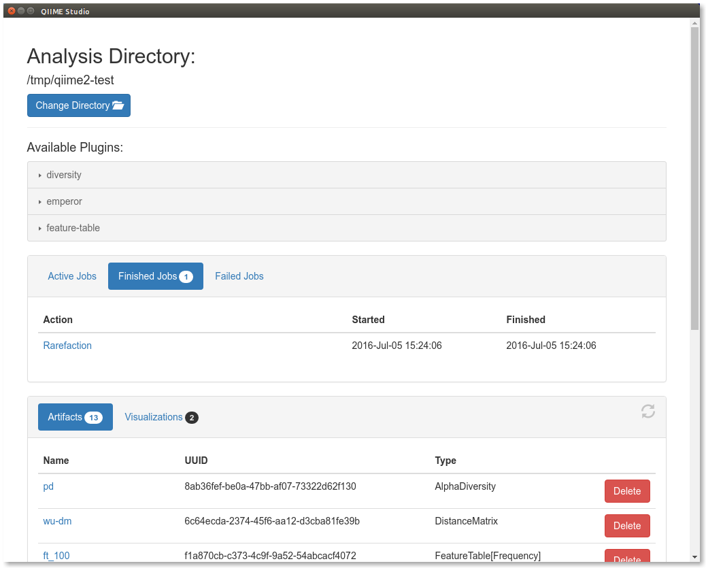

# QIIME 2 Studio

QIIME 2 Studio is a graphical user interface for QIIME 2. This document will show you how to install and use QIIME 2 Studio, and is intended to be run after you've run [Installing-and-using-QIIME-2](Installing-and-using-QIIME-2.html). The examples presented here assume that you already have QIIME and some plugins installed, and rely on the QIIME Artifacts you downloaded and generated in that tutorial.

**IMPORTANT: Currently installing QIIME 2 Studio requires a source installation, soon after alpha we will provide a package distribution/installer which will greatly simplify this process.**

**This interface will require that your system has [`Node.js`](https://nodejs.org/en/). We currently require version 5 or later, you can find [installation instructions here](https://nodejs.org/en/download/current/).** (This will be unnecessary with the future installer.)

Once you have installed `Node.js >= 5` you will need to download and extract the interface's source:

```bash
curl -s https://codeload.github.com/qiime2/q2studio/zip/0.0.1 -o q2studio-0.0.1.zip
unzip q2studio-0.0.1.zip && rm q2studio-0.0.1.zip
```

Next we need to install it (both as a Python package, and as a Node.js package):

```bash
cd q2studio-0.0.1
pip install .
npm install && npm run build
```

Finally we will be able to launch the interface with:

```bash
npm start
```

**NOTE: You must be in `qiime2-test/q2studio-0.0.1` in order to run `npm start`.**

This will bring up a new window that looks like the following:


There are four sections to this interface. At the top you are able to select the directory in which you want to work. By default it starts in your home directory, but we want to change it to our current `qiime2-test` directory. To do so click the `Change Directory` button and navigate to that directory.

The next component of this interface are the available plugins. Clicking on a plugin reveals the available methods and visualizers. Notice that these are the same plugins and methods/visualizers that are available through the command line interface.

In the middle of the interface we have the job pane. You can choose between `Active Jobs`, `Finished Jobs`, and `Failed Jobs`. As we have not run anything yet, each tab is currently empty.

Finally in the bottom pane you'll see the artifacts and visualizations in the current directory.

Once you have changed directories you should see 12 artifacts and 2 visualizations. Choose the ``Rarefy table`` method from the `feature-table` plugin, which will change the page to look like the following:


On this page, you'll select your inputs and name your outputs. The inputs corresponding to QIIME artifacts (``Input Artifact: table`` on this method) will be populated with the available artifacts that are of the correct type. Fill in a rarefaction depth (`counts_per_sample`) of 100, name the output file `ft_100`, and click ``Go!``. This starts a job which will show in the ``Active Jobs`` tab until it completes where it will appear in the ``Finished Jobs`` (or ``Failed Jobs`` if something went wrong).



You can select a job by clicking on it, bringing up a new window describing further details:


You should spend a few minutes experimenting with other plugins.
