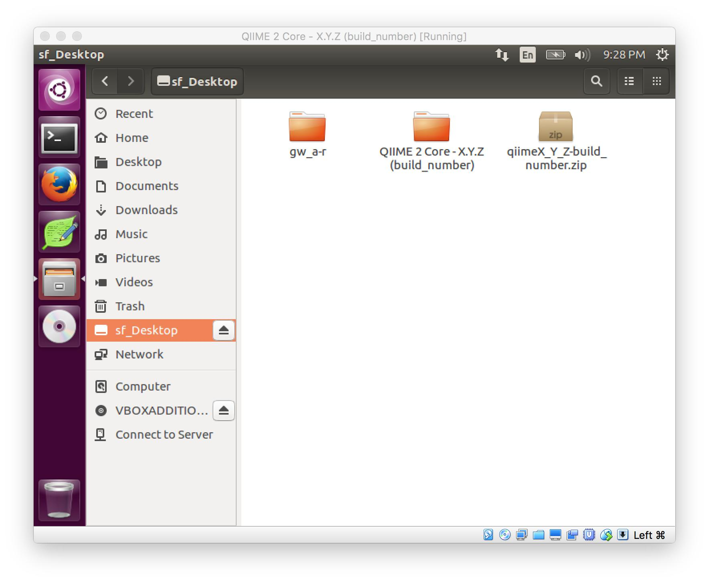

Installing QIIME 2 using Virtual Machines
=========================================

QIIME 2 "core distribution" builds are available as VirtualBox VMDK Images, Amazon Web Services (AWS) EC2 AMI Images, and Docker Images. These options can get you a working QIIME 2 installation very quickly.

The core distribution builds contain the following plugins:

- ``alignment``
- ``composition``
- ``dada2``
- ``demux``
- ``diversity``
- ``emperor``
- ``feature-classifier``
- ``feature-table``
- ``phylogeny``
- ``taxa``
- ``types``

.. note:: At this stage we're unsure of what types of virtual machine builds we'll continue to release in the future. We expect that for the first half of 2017 we'll provide the three builds included here, but we may ultimately phase out the AWS and VirtualBox builds. This is because our release of these builds restricts users to a specific operating system/cloud platform/etc, so we feel that we may better serve our user community by providing cross-platform builds (e.g., Docker containers) and detailed instructions for how to work with these.

VirtualBox
----------

1. Install VirtualBox on your computer
~~~~~~~~~~~~~~~~~~~~~~~~~~~~~~~~~~~~~~

Please see https://VirtualBox.org for details on how to install VirtualBox on your computer. Please note, some computers require activating a BIOS setting to enable virtualization --- please consult your hardware documentation to determine if you need to do this, and how.

2. Download the QIIME 2 Core VirtualBox Image
~~~~~~~~~~~~~~~~~~~~~~~~~~~~~~~~~~~~~~~~~~~~~

Please note, this installation document uses some placeholders throughout the following steps. ``X.Y.Z`` represents the version of QIIME 2 (e.g. ``2017.2.0``), and ``build_number`` represents the build identifier for the VirtualBox image (an internal reference used by the QIIME 2 Developement Team). If you select the "Browser" option below, the file will automatically rename to the version and build number necessary.

.. download::
   :no-exec:
   :url: https://data.qiime2.org/distro/core/latest
   :saveas: qiimeX_Y_Z-build_number.zip

3. Unzip the file
~~~~~~~~~~~~~~~~~

Unzip the ``qiimeX_Y_Z-build_number.zip`` file and open the directory that you chose to unzip to.

4. Launch VirtualBox
~~~~~~~~~~~~~~~~~~~~

Double-click the file named ``QIIME 2 Core - X.Y.Z (build_number).ovf``.

.. image:: images/vbox-install/vbox-01.jpg

You will be presented with an ``Appliance Settings`` import page. We have selected default settings for you that should work for most light workloads. If you are interested in changing the allocations (e.g. memory or CPUs), feel free to adjust these settings. When done, click ``Import``.

.. image:: images/vbox-install/vbox-02.jpg

Once the import is complete, double-click on the new Virtual Machine entry that matches the ``X.Y.Z`` & ``build_number`` version that you just imported.

.. image:: images/vbox-install/vbox-03.jpg

5. Launch the virtual machine
~~~~~~~~~~~~~~~~~~~~~~~~~~~~~

When prompted, select the user ``qiime2``, and enter the password ``qiime2``.

.. image:: images/vbox-install/vbox-04.jpg

Once logged in you should see a screen like this:

.. image:: images/vbox-install/vbox-05.jpg

Success!

6. Clean up
~~~~~~~~~~~

The import process creates a copy of the files from the directory that you unzipped in step 3 above. If you would like to reclaim that disk space, feel free to delete ``qiimeX_Y_Z-build_number.zip``, and the unzipped folder from that file.

Optional: Shared Folders and Copy-and-Paste
~~~~~~~~~~~~~~~~~~~~~~~~~~~~~~~~~~~~~~~~~~~

1. Install Guest Additions
..........................

After clicking on the CD icon in the lower left, click on ``Run Software`` in the upper right.

.. image:: images/vbox-guest/vbox-01.jpg

Enter the password (``qiime2``) when prompted.

.. image:: images/vbox-guest/vbox-02.jpg

When installation is done, your screen should look like the following. Follow the prompt and press ``Return``

.. image:: images/vbox-guest/vbox-03.jpg

2. Set up a shared folder
.........................

In the VirtualBox menu bar on your host computer, select ``Devices -> Shared Folders -> Shared Folders Settings`` (note, this might be slightly different on Windows or Linux systems, please check the official `VirtualBox Docs`_). Click on the green plus sign/folder on the right side of the window, you should see a new screen prompting you for info:

.. image:: images/vbox-guest/vbox-04.jpg

Click on the ``Folder Path`` input, and using the file browser (by selecting the option ``Other...``), select the folder you want to share with the VM. This example uses the Desktop (e.g. ``/Users/matthew/Desktop`` on a Mac). Make sure to select ``Auto-mount`` and ``Make Permanent``, if you don't want to repeat these steps every time you launch the VM. Also note, the ``Folder Name`` option (which VirtualBox will auto-suggest a value for) is the name of the mounted folder inside of your VM.  VirtualBox will always prepend the prefix ``sf_`` to that value (``sf`` stands for ``shared folder``). So in this case, the folder name will be ``sf_Desktop``. The full path when mounted is ``/media/sf_Desktop``.

.. image:: images/vbox-guest/vbox-05.jpg

Click 'OK' on both dialogs to save your changes.

3. Reboot
.........

Click the gear in the upper right of the screen, then ``Shut Down...``, then ``Restart``.

.. image:: images/vbox-guest/vbox-06.jpg

4. Enjoy!
.........

Once the VM has rebooted and you have logged in, you should see your shared folder in the file browser (the icon on the left bar that looks like a file cabinet):

The files there are the files on the Mac's desktop! These files can also access the mounted folder via the Command Line at ``/media/sf_Desktop``:

.. image:: images/vbox-guest/vbox-08.jpg

Amazon Web Services
-------------------

1. Set up an AWS account at https://aws.amazon.com, and log in.
2. Set your region to "US West (Oregon)".
3. When launching an instance, select "Community AMIs", and search for "QIIME 2 Core" (the AMI ID is `ami-c401aca4`).
4. When prompted to set up a security group, make sure that port 22 is open.
5. When prompted to set up an SSH keypair, choose "Proceed without a keypair".
6. Once the machine has finished booting, you can SSH into it by running ``ssh qiime2@<PUBLIC_AWS_IP_ADDRESS>``, replacing ``<PUBLIC_AWS_IP_ADDRESS>`` with the public IP address for the machine (this will be provided by AWS). When prompted, provide the password ``qiime2``.

Docker
------

1. Set up Docker on your computer (see https://docker.com for details).
2. In a terminal with Docker activated, run ``docker pull qiime2/core:latest``.
3. Run ``docker run -t -i -v $(pwd):/data qiime2/core qiime`` to confirm that the image was successfully fetched.

.. _`VirtualBox Docs`: https://www.virtualbox.org/manual/UserManual.html
