Installing QIIME 2 using VirtualBox
===================================

.. warning::
   The following steps require at least ~25 GB of free disk space: ~5 GB for the ZIP file, ~5 GB for the unzipped ZIP file contents, and ~15 GB for the installed Virtual Machine (VM). Once you have installed the VM you can free up ~10 GB of space by deleting the ZIP + the unzipped ZIP file contents.

The QIIME 2 VirtualBox image offers a convenient way to get QIIME 2 up and running, and is also the easiest way to get your hands on the experimental preview of :doc:`QIIME 2 Studio <../../interfaces/q2studio>`.

1. Install VirtualBox on your computer
~~~~~~~~~~~~~~~~~~~~~~~~~~~~~~~~~~~~~~

Please see https://www.virtualbox.org for details on how to install VirtualBox on your computer. Please note, some computers require activating a BIOS setting to enable virtualization --- please consult your hardware documentation to determine if you need to do this, and how. After installing VirtualBox, take note of the version of VirtualBox that was installed.

2. Download the QIIME 2 Core VirtualBox Image
~~~~~~~~~~~~~~~~~~~~~~~~~~~~~~~~~~~~~~~~~~~~~

Please note, this installation document uses some placeholders throughout the following steps. ``X.Y.Z`` represents the version of QIIME 2 (e.g. ``2020.2``), and ``build_number`` represents the build identifier for the VirtualBox image (an internal reference used by the QIIME 2 Developement Team). Please see the `VirtualBox Images`_ download link to get the download URL for the latest image. The minimum version of VirtualBox (as determined in Step 1 above) is provided for the latest releases of the VirtualBox image --- please ensure you have installed a version of VirtualBox that is equal to or greater than the version of the QIIME 2 VirtualBox image you wish to install.

3. Unzip the file
~~~~~~~~~~~~~~~~~

Unzip/extract the ``qiimeX_Y_Z-build_number.zip`` file and open the directory that you chose to unzip to. Please note, some operating systems (e.g. Windows) open a read-only view of the ZIP file, which has not actually been extracted. Please follow the directions for your operating system/unarchiver tool as necessary.

4. Launch VirtualBox
~~~~~~~~~~~~~~~~~~~~

Double-click the file named ``QIIME 2 Core - X.Y.Z (build_number).ovf``.

.. note::
   The file ending with the extension ``ovf`` is a type of VirtualBox "recipe" --- it allows the QIIME 2 developers to define a set of reasonable default configuration values, rather than requiring you to manually specify RAM, CPU count, etc. The file ending with the extension ``vmdk`` is the actual virtual machine disk image. If you don't want to import using the defaults specified in the ``ovf`` you can use the ``vmdk`` file to manually import the VM --- see the `VirtualBox Docs`_ for details.

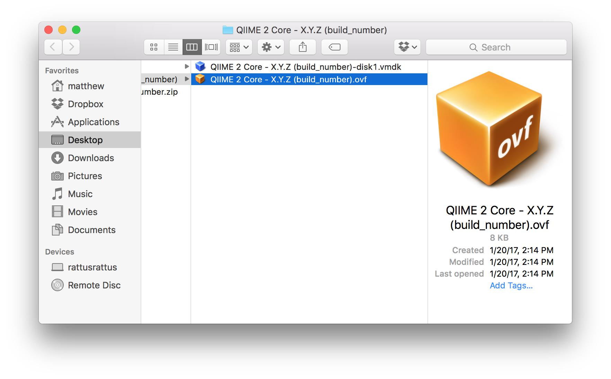

You will be presented with an ``Appliance Settings`` import page. We have selected default settings for you that should work for most light workloads. If you are interested in changing the allocations (e.g. memory or CPUs), feel free to adjust these settings. When done, click ``Import``.

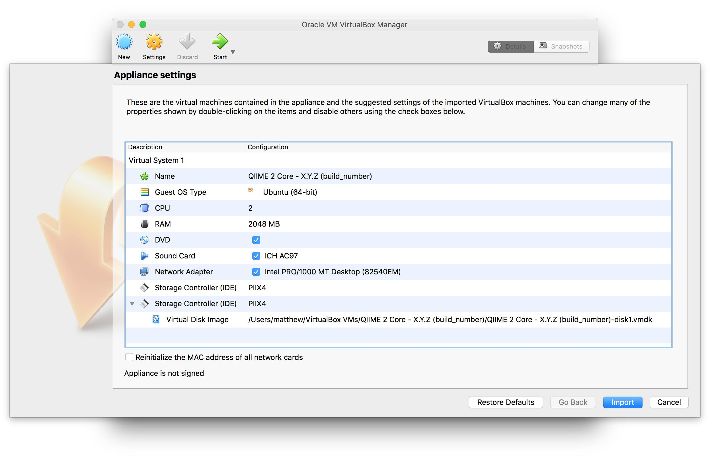

Once the import is complete, double-click on the new Virtual Machine entry that matches the ``X.Y.Z`` & ``build_number`` version that you just imported.

.. image:: images/vbox-install-03.jpg

5. Launch the virtual machine
~~~~~~~~~~~~~~~~~~~~~~~~~~~~~

When prompted, select the user ``qiime2``, and enter the password ``qiime2``.

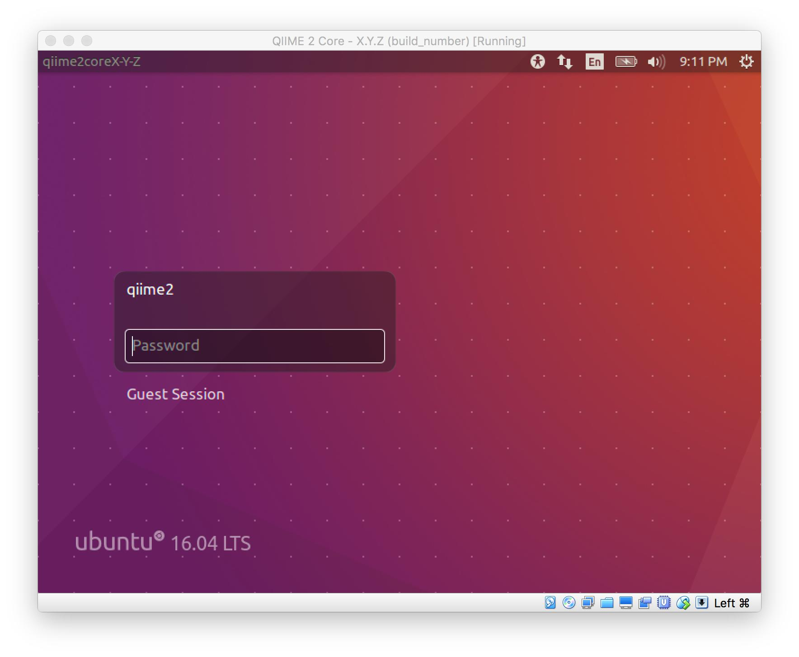

Once logged in you should see a screen like this:

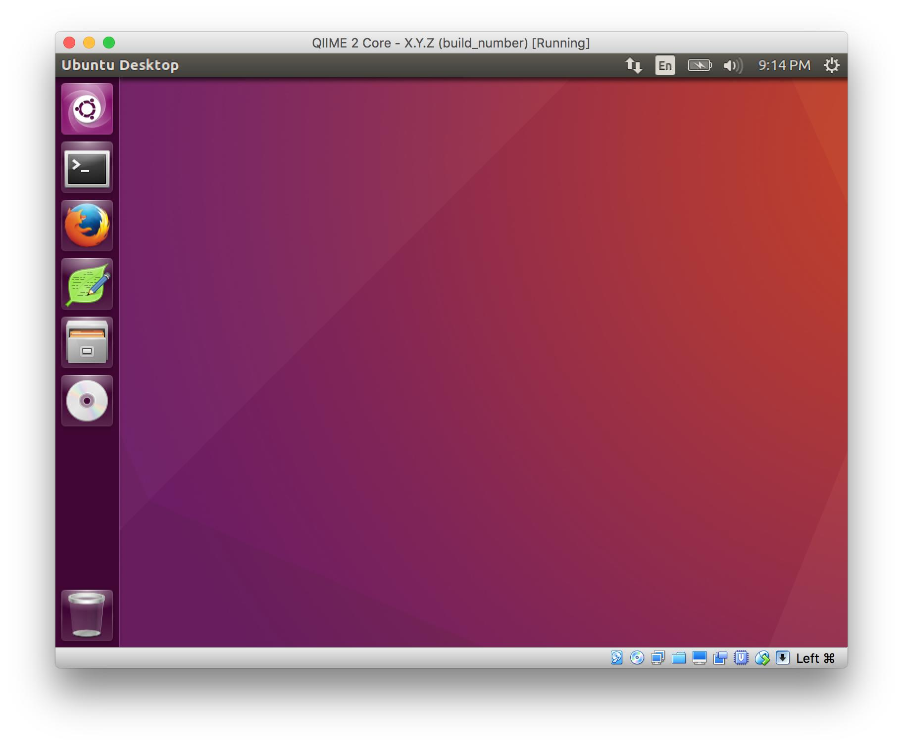

Success! To confirm that everything is working, you can open up a terminal and run the following command:

.. command-block::

   qiime info

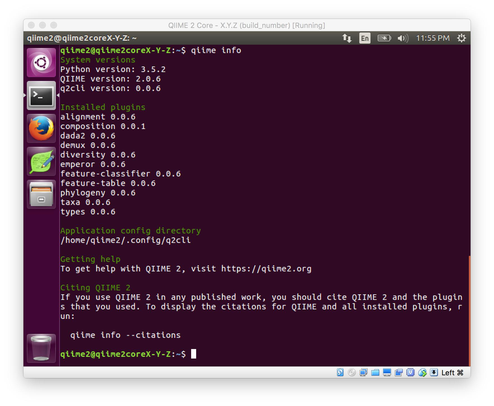

Note, the list of installed plugins (and their versions) will likely differ depending on the version of the VirtualBox virtual machine that you chose to download and install.

6. Clean up
~~~~~~~~~~~

The import process creates a copy of the files from the directory that you unzipped in step 3 above. If you would like to reclaim that disk space, feel free to delete ``qiimeX_Y_Z-build_number.zip``, and the unzipped folder from that file.

Optional: Shared Folders and Copy-and-Paste
~~~~~~~~~~~~~~~~~~~~~~~~~~~~~~~~~~~~~~~~~~~

1. Install Guest Additions
..........................

.. note::
  **Optional**: Guest Additions are already installed in the virtual machine, but if you need to reinstall (or update) them, you can perform the following steps.

Attach the Guest Additions DVD by following the instructions outlined in the `VirtualBox Guest Additions Docs`_.

Once inserted, the Guest Additions DVD should automatically launch (if not, double-click the DVD and click the 'Run Software' button in the upper right:

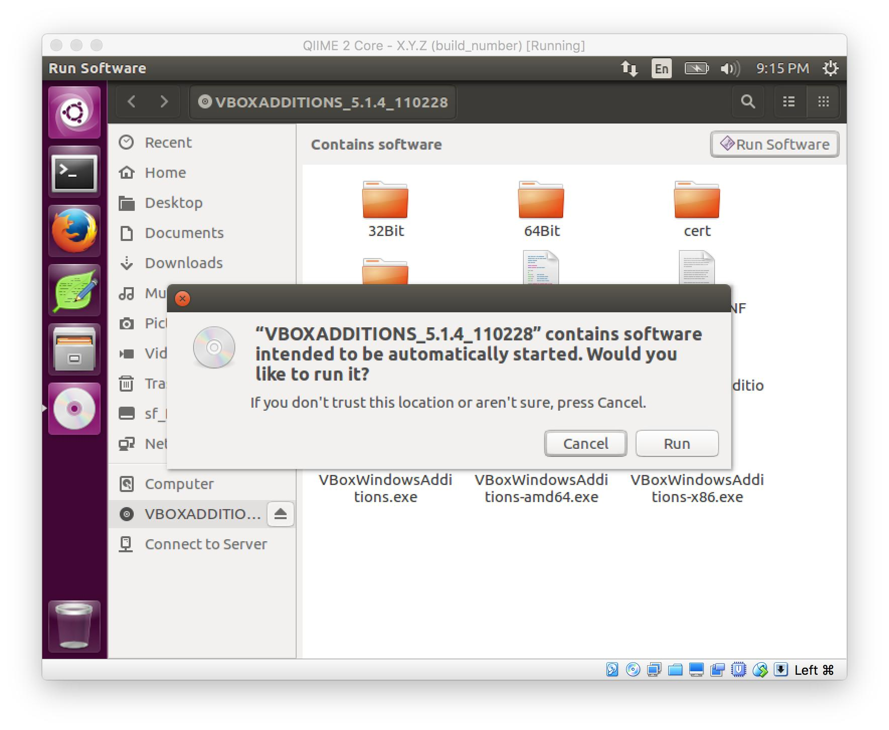

Enter the password (``qiime2``) when prompted.

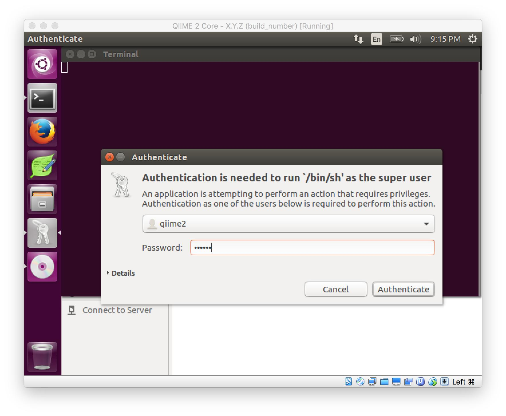

When installation is done, your screen should look like the following. Follow the prompt and press ``Return``.

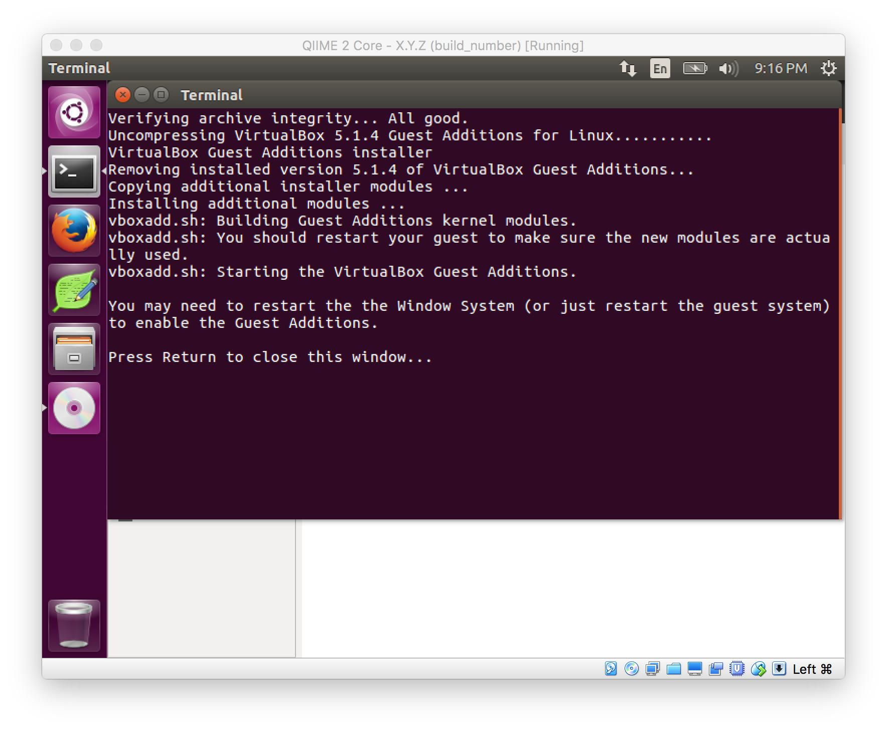

2. Set up copy-and-paste
........................

In the VirtualBox menu bar on your host computer, select ``Machine -> Settings``, then click ``General`` in the top bar, and ``Advanced`` in the bar immediately below it. We recommend setting ``Shared Clipboard`` and ``Drag'n'Drop`` to ``Bidirectional``, which will allow copy-and-paste from host-to-guest and from guest-to-host. The ``Drag'n'Drop`` allows you to drag folders into the window to copy them into your Virtual Machine. Click ``OK`` when you are done.

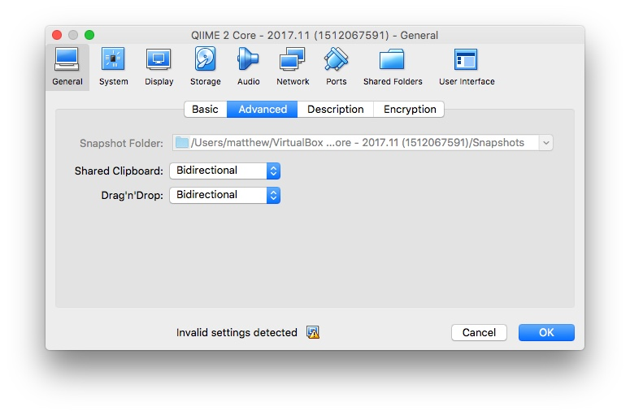

3. Set up a shared folder
.........................

In the VirtualBox menu bar on your host computer, select ``Devices -> Shared Folders -> Shared Folders Settings`` (note, this might be slightly different on Windows or Linux systems, please check the official `VirtualBox Docs`_). Click on the green plus sign/folder on the right side of the window, you should see a new screen prompting you for info:

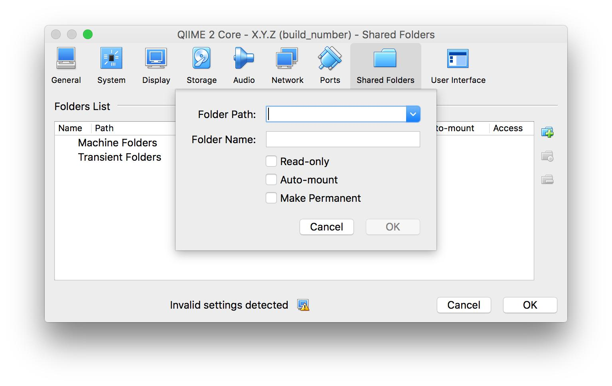

Click on the ``Folder Path`` input, and using the file browser (by selecting the option ``Other...``), select the folder you want to share with the VM. This example uses the Desktop (e.g. ``/Users/matthew/Desktop`` on a Mac). Make sure to select ``Auto-mount`` and ``Make Permanent``, if you don't want to repeat these steps every time you launch the VM. Also note, the ``Folder Name`` option (which VirtualBox will auto-suggest a value for) is the name of the mounted folder inside of your VM.  VirtualBox will always prepend the prefix ``sf_`` to that value (``sf`` stands for ``shared folder``). So in this case, the folder name will be ``sf_Desktop``. The full path when mounted is ``/media/sf_Desktop``.

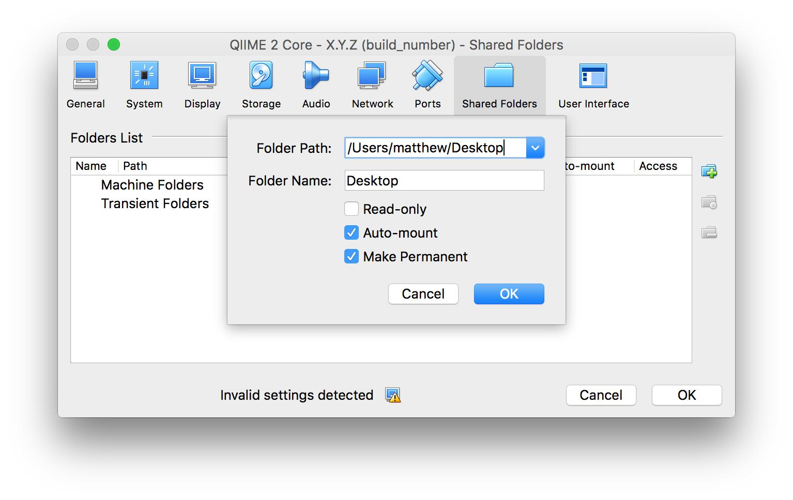

Click 'OK' on both dialogs to save your changes.

4. Reboot
.........

Click the gear in the upper right of the screen, then ``Shut Down...``, then ``Restart``.

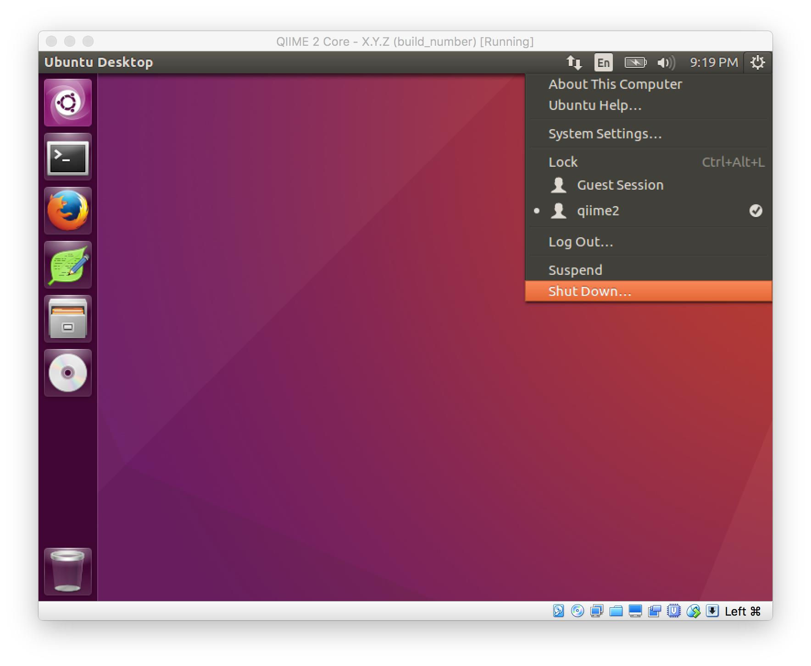

5. Enjoy!
.........

Once the VM has rebooted and you have logged in, you should see your shared folder in the file browser (the icon on the left bar that looks like a file cabinet):

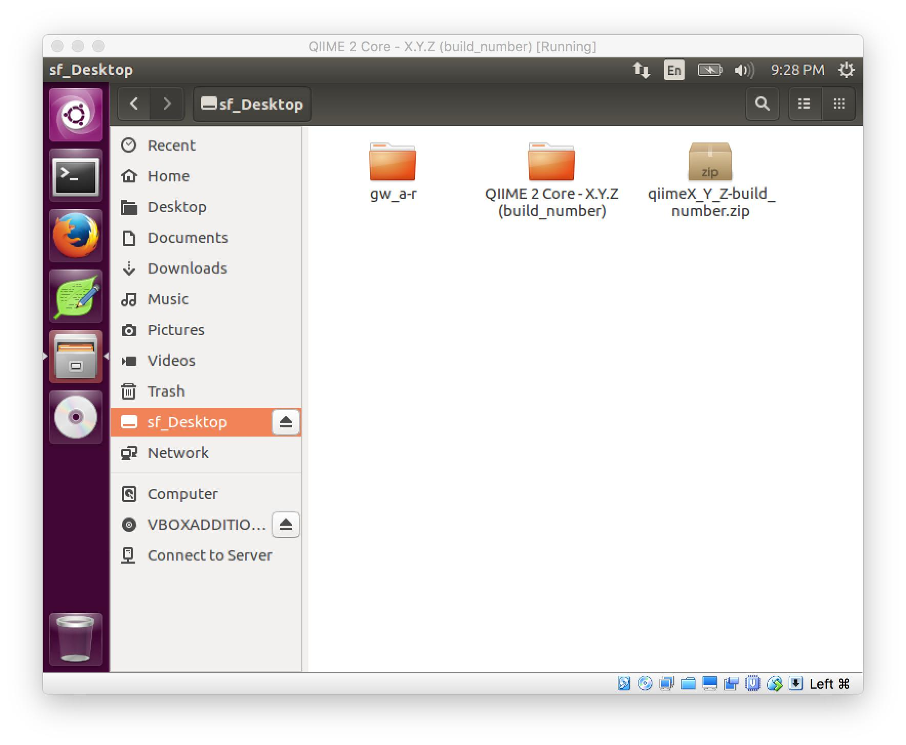

The files there are the files on the Mac's desktop! These files can also access the mounted folder via the Command Line at ``/media/sf_Desktop``:

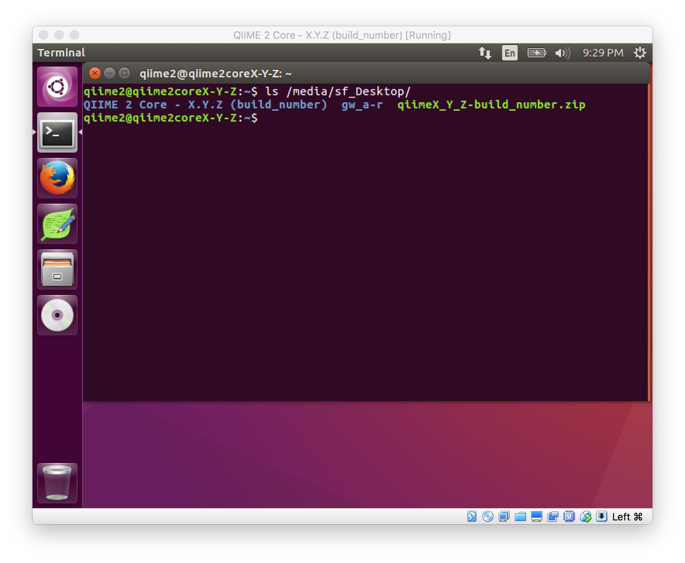

Lastly, if you want to create a symbolic link to your shared folder to a more convenient location on your VM, you can run the following command:

.. command-block::
   :no-exec:

   ln -s /media/sf_Desktop ~/Desktop/shared

Where ``sf_Desktop`` is the name of the shared directory from step 2 above, and ``~/Desktop/shared`` is a location of your choosing.

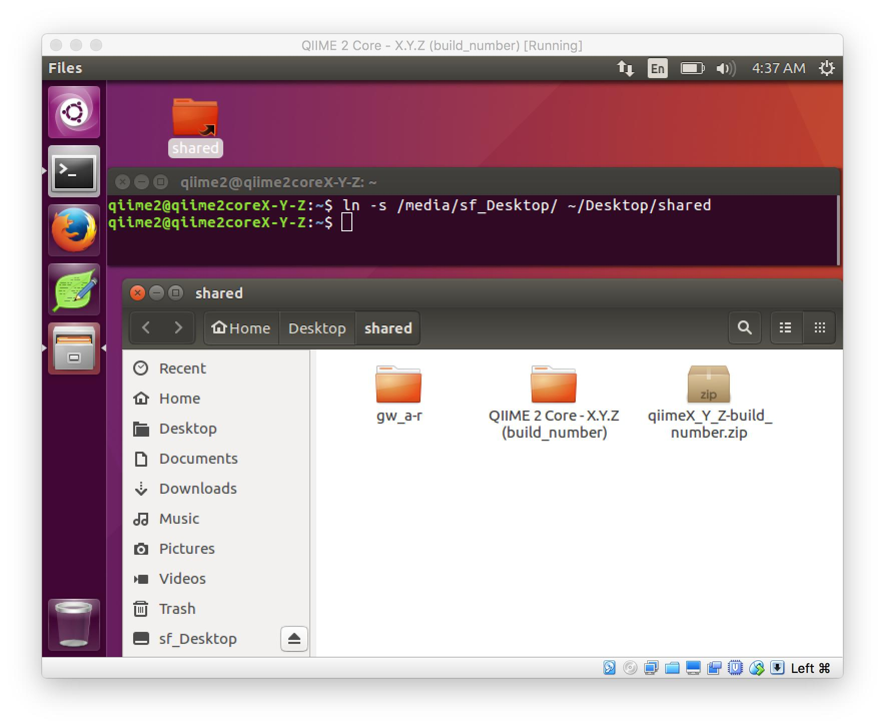

.. _`VirtualBox Images`: https://data.qiime2.org/distro/core/virtualbox-images.txt
.. _`VirtualBox Docs`: https://www.virtualbox.org/manual/UserManual.html
.. _`VirtualBox Guest Additions Docs`: https://www.virtualbox.org/manual/ch04.html#mountingadditionsiso
