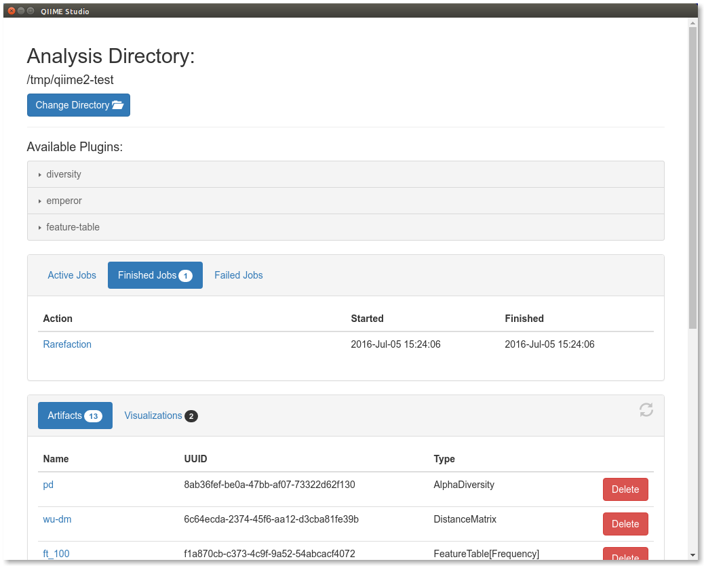

QIIME 2 Studio (q2studio)
=========================

.. note:: This guide assumes you have performed the steps in the :doc:`Moving Pictures tutorial <../tutorials/moving-pictures>`. The ``table.qza`` file generated in that tutorial is used here.

QIIME 2 Studio (``q2studio``) is a graphical user interface for QIIME 2. This document will show you how to install and use QIIME 2 Studio as a desktop application.

.. note:: QIIME 2 Studio currently requires a source installation. In the future, we will provide a package distribution/installer which will greatly simplify the installation process presented here. An experimental build of QIIME 2 Studio is available as a pre-installed package in the :doc:`VirtualBox image <../install/virtual/virtualbox>`.

Launching QIIME 2 Studio requires an active ``conda`` environment with QIIME 2 installed in it. Failure to activate a compatible ``conda`` environment will likely produce errors, and possibly cause the application to crash. If you have not activated your ``conda`` environment already, please do so now:

.. command-block::
   :no-exec:

   source activate qiime2-2020.2

Please note, your ``conda`` environment might have a name other than ``qiime2-2020.2``, if you or your system administrator provided one during :doc:`installation of QIIME 2 <../install/index>`.

This interface requires that your system has `Node.js`_. We currently require version 5 or later; you can find `installation instructions here <https://nodejs.org/en/download/current/>`__. This dependency will be unnecessary in the future.

Once you have installed ``Node.js >= 5`` you will need to download and extract the interface's source:

.. download::
   :url: https://codeload.github.com/qiime2/q2studio/zip/2020.2.0
   :saveas: q2studio-2020.2.0.zip
   :no-exec:

.. command-block::
   :no-exec:

   unzip q2studio-2020.2.0.zip && rm q2studio-2020.2.0.zip
   cd q2studio-2020.2.0

Next we need to install it (both as a Python package, and as a Node.js package):

.. command-block::
   :no-exec:

   pip install .
   npm install && npm run build

Finally we will be able to launch the interface with:

.. command-block::
   :no-exec:

   npm start

This will bring up a new window that looks like the following:

.. image:: images/studio-1.png

There are four sections to this interface. At the top you are able to select the directory in which you want to work. By default it starts in your home directory, but we want to change it to the directory where the :doc:`Moving Pictures tutorial <../tutorials/moving-pictures>` was run. To do so, click the `Change Directory` button and navigate to that directory.

The next component of this interface are the available plugins. Clicking on a plugin reveals the available methods and visualizers. Notice that these are the same plugins and methods/visualizers that are available through the command line interface (and other QIIME 2 interfaces).

In the middle of the interface we have the job pane. You can choose between ``Active Jobs``, ``Finished Jobs``, and ``Failed Jobs``. As we have not run anything yet, each tab is currently empty.

Finally in the bottom pane you'll see the artifacts and visualizations in the current directory. These ``.qza`` and ``.qzv`` files are the ones generated from the Moving Pictures tutorial.

Choose the ``Rarefy table`` method from the ``feature-table`` plugin, which will change the page to look like the following:

.. image:: images/studio-2.png

On this page, you'll select your inputs and name your outputs. The inputs corresponding to QIIME 2 artifacts (``Input Artifact: table`` on this method) will be populated with the available artifacts that are of the correct semantic type. Select the ``table.qza`` artifact that was generated in the Moving Pictures tutorial as the input artifact. Fill in a rarefaction depth (``sampling depth``) of 100, name the output file ``rarefied_table_100``, and click ``Go!``. This starts a job which will show in the ``Active Jobs`` tab until it completes, after which it will appear in the ``Finished Jobs`` tab (or ``Failed Jobs`` tab if something went wrong).

You can select a job by clicking on it, bringing up a new window describing further details:

.. image:: images/studio-4.png

Try using the QIIME 2 Studio to experiment with other plugins!

.. _`Node.js`: https://nodejs.org/en/
