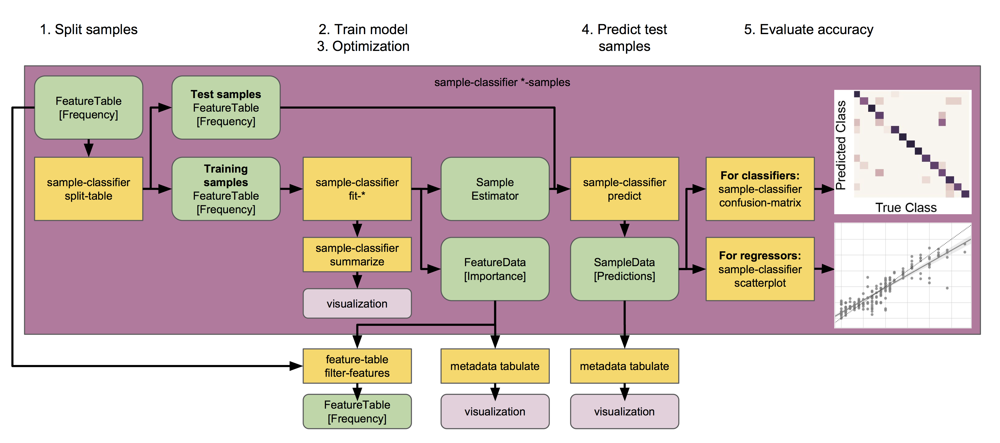

FAES QIIME 2 Workshop (December 2018)
=====================================

.. contents:: FAES QIIME 2 Workshop
   :depth: 5

.. note:: This guide assumes you have installed QIIME 2 using one of the procedures in the :doc:`install documents <../install/index>`.

System Setup
------------

In this tutorial we will use several different datasets, these are already available in your cluster environment, but if you want to follow along on a different machine, you should run the steps below:

.. command-block::

   mkdir moving-pictures
   mkdir cheese
   mkdir ecam

.. download::
   :url: https://s3-us-west-2.amazonaws.com/qiime2-workshops/faes18/starting-data/moving-pictures/emp-single-end-sequences.qza
   :saveas: moving-pictures/emp-single-end-sequences.qza

.. download::
   :url: https://s3-us-west-2.amazonaws.com/qiime2-workshops/faes18/starting-data/moving-pictures/sample-metadata.tsv
   :saveas: moving-pictures/sample-metadata.tsv

.. download::
   :url: https://s3-us-west-2.amazonaws.com/qiime2-workshops/faes18/starting-data/cheese/gg-99-ref-seqs.qza
   :saveas: cheese/gg-99-ref-seqs.qza

.. download::
   :url: https://s3-us-west-2.amazonaws.com/qiime2-workshops/faes18/starting-data/cheese/gg-99-ref-taxa.qza
   :saveas: cheese/gg-99-ref-taxa.qza

.. download::
   :url: https://s3-us-west-2.amazonaws.com/qiime2-workshops/faes18/starting-data/cheese/cheese-table.qza
   :saveas: cheese/cheese-table.qza

.. download::
   :url: https://s3-us-west-2.amazonaws.com/qiime2-workshops/faes18/starting-data/ecam/ecam-metadata.tsv
   :saveas: ecam/ecam-metadata.tsv

.. download::
   :url: https://s3-us-west-2.amazonaws.com/qiime2-workshops/faes18/starting-data/ecam/ecam-table.qza
   :saveas: ecam/ecam-table.qza

.. download::
   :url: https://s3-us-west-2.amazonaws.com/qiime2-workshops/faes18/starting-data/ecam/ecam-shannon.qza
   :saveas: ecam/ecam-shannon.qza

.. download::
   :url: https://s3-us-west-2.amazonaws.com/qiime2-workshops/faes18/starting-data/ecam/ecam-unweighted-unifrac-distance-matrix.qza
   :saveas: ecam/ecam-unweighted-unifrac-distance-matrix.qza

.. _`moving pics sample metadata`:

Sample metadata
---------------

.. command-block::

   qiime metadata tabulate \
     --m-input sample-metadata.tsv \
     --o-visualization sample-metadata.qzv

.. _`moving pics demux`:

Demultiplexing sequences
------------------------

.. command-block::

   cd moving-pictures

To demultiplex sequences we need to know which barcode sequence is associated with each sample. This information is contained in the `sample metadata`_ file. You can run the following commands to demultiplex the sequences (the ``demux emp-single`` command refers to the fact that these sequences are barcoded according to the `Earth Microbiome Project`_ protocol, and are single-end reads). The ``demux.qza`` QIIME 2 artifact will contain the demultiplexed sequences.

.. command-block::

    qiime demux emp-single \
      --i-seqs emp-single-end-sequences.qza \
      --m-barcodes-file sample-metadata.tsv \
      --m-barcodes-column BarcodeSequence \
      --o-per-sample-sequences demux.qza

After demultiplexing, it's useful to generate a summary of the demultiplexing results. This allows you to determine how many sequences were obtained per sample, and also to get a summary of the distribution of sequence qualities at each position in your sequence data.

.. command-block::

    qiime demux summarize \
      --i-data demux.qza \
      --o-visualization demux.qzv

.. note::
   All QIIME 2 visualizers (i.e., commands that take a ``--o-visualization`` parameter) will generate a ``.qzv`` file. You can view these files with ``qiime tools view``. We provide the command to view this first visualization, but for the remainder of this tutorial we'll tell you to *view the resulting visualization* after running a visualizer, which means that you should run ``qiime tools view`` on the .qzv file that was generated.

   .. command-block::
      :no-exec:

      qiime tools view demux.qzv

   Alternatively, you can view QIIME 2 artifacts and visualizations at `view.qiime2.org <https://view.qiime2.org>`__ by uploading files or providing URLs. There are also precomputed results that can be viewed or downloaded after each step in the tutorial. These can be used if you're reading the tutorial, but not running the commands yourself.

.. _`moving pics dada2 denoise`:

Sequence quality control and feature table construction
-------------------------------------------------------

QIIME 2 plugins are available for several quality control methods, including `DADA2`_, `Deblur`_, and `basic quality-score-based filtering`_. In this tutorial we present this step using `DADA2`_. The result will be a ``FeatureTable[Frequency]`` QIIME 2 artifact, which contains counts (frequencies) of each unique sequence in each sample in the dataset, and a ``FeatureData[Sequence]`` QIIME 2 artifact, which maps feature identifiers in the ``FeatureTable`` to the sequences they represent.

.. qiime1-users::
   The ``FeatureTable[Frequency]`` QIIME 2 artifact is the equivalent of the QIIME 1 OTU or BIOM table, and the ``FeatureData[Sequence]`` QIIME 2 artifact is the equivalent of the QIIME 1 *representative sequences* file. Because the "OTUs" resulting from `DADA2`_ and `Deblur`_ are created by grouping unique sequences, these are the equivalent of 100% OTUs from QIIME 1, and are generally referred to as *sequence variants*. In QIIME 2, these OTUs are higher resolution than the QIIME 1 default of 97% OTUs, and they're higher quality since these quality control steps are better than those implemented in QIIME 1. This should therefore result in more accurate estimates of diversity and taxonomic composition of samples than was achieved with QIIME 1.

`DADA2`_ is a pipeline for detecting and correcting (where possible) Illumina amplicon sequence data. As implemented in the ``q2-dada2`` plugin, this quality control process will additionally filter any phiX reads (commonly present in marker gene Illumina sequence data) that are identified in the sequencing data, and will filter chimeric sequences.

The ``dada2 denoise-single`` method requires two parameters that are used in quality filtering: ``--p-trim-left m``, which trims off the first ``m`` bases of each sequence, and ``--p-trunc-len n`` which truncates each sequence at position ``n``. This allows the user to remove low quality regions of the sequences. To determine what values to pass for these two parameters, you should review the *Interactive Quality Plot* tab in the ``demux.qzv`` file that was generated by ``qiime demux summarize`` above.

.. question::
   Based on the plots you see in ``demux.qzv``, what values would you choose for ``--p-trunc-len`` and ``--p-trim-left`` in this case?

In the ``demux.qzv`` quality plots, we see that the quality of the initial bases seems to be high, so we won't trim any bases from the beginning of the sequences. The quality seems to drop off around position 120, so we'll truncate our sequences at 120 bases. This next command may take up to 10 minutes to run, and is the slowest step in this tutorial.

.. command-block::

   qiime dada2 denoise-single \
     --i-demultiplexed-seqs demux.qza \
     --p-trim-left 0 \
     --p-trunc-len 120 \
     --o-representative-sequences rep-seqs.qza \
     --o-table table.qza \
     --o-denoising-stats stats-dada2.qza

.. command-block::

   qiime metadata tabulate \
     --m-input-file stats-dada2.qza \
     --o-visualization stats-dada2.qzv

.. _`moving pics dada2 summaries`:

FeatureTable and FeatureData summaries
--------------------------------------

After the quality filtering step completes, you'll want to explore the resulting data. You can do this using the following two commands, which will create visual summaries of the data. The ``feature-table summarize`` command will give you information on how many sequences are associated with each sample and with each feature, histograms of those distributions, and some related summary statistics. The ``feature-table tabulate-seqs`` command will provide a mapping of feature IDs to sequences, and provide links to easily BLAST each sequence against the NCBI nt database. The latter visualization will be very useful later in the tutorial, when you want to learn more about specific features that are important in the data set.

.. command-block::

   qiime feature-table summarize \
     --i-table table.qza \
     --o-visualization table.qzv \
     --m-sample-metadata-file sample-metadata.tsv
   qiime feature-table tabulate-seqs \
     --i-data rep-seqs.qza \
     --o-visualization rep-seqs.qzv

.. _`moving pics rarefaction`:

Rarefaction
-----------

An important parameter that needs to be provided to future steps in this analysis involves the even sampling (i.e. rarefaction) depth. Because most diversity metrics are sensitive to different sampling depths across different samples, this script will randomly subsample the counts from each sample to the value provided for this parameter. For example, if you specify 500 as an even sampling depth, this step will subsample the counts in each sample without replacement so that each sample in the resulting table has a total count of 500. If the total count for any sample(s) are smaller than this value, those samples will be dropped from the diversity analysis. Choosing this value is tricky. We recommend making your choice by reviewing the information presented in the ``table.qzv`` file that was created above and choosing a value that is as high as possible (so you retain more sequences per sample) while excluding as few samples as possible.

.. question::
   View the ``table.qzv`` QIIME 2 artifact, and in particular the *Interactive Sample Detail* tab in that visualization. What value would you choose to pass for ``--p-sampling-depth``? How many samples will be excluded from your analysis based on this choice? How many total sequences will you be analyzing in the ``core-metrics-phylogenetic`` command?

.. _`moving pics build tree`:

Generate a tree for phylogenetic diversity analyses
---------------------------------------------------

QIIME supports several phylogenetic diversity metrics, including Faith's Phylogenetic Diversity and weighted and unweighted UniFrac. In addition to counts of features per sample (i.e., the data in the ``FeatureTable[Frequency]`` QIIME 2 artifact), these metrics require a rooted phylogenetic tree relating the features to one another. This information will be stored in a ``Phylogeny[Rooted]`` QIIME 2 artifact.

QIIME 2 has several methods generate a rooted phylogenetic tree. Here's we'll use ``align-to-tree-mafft-fasttree``.

The following command will produce a few outputs. We're primarily interested in ``rooted-tree.qza``, the ``Phylogeny[Rooted]``.

.. command-block::

   qiime phylogeny align-to-tree-mafft-fasttree \
     --i-sequences rep-seqs.qza \
     --o-alignment aligned-rep-seqs.qza \
     --o-masked-alignment masked-aligned-rep-seqs.qza \
     --o-tree unrooted-tree.qza \
     --o-rooted-tree rooted-tree.qza

.. _`moving pics diversity`:

Alpha and beta diversity analysis
---------------------------------

QIIME 2's diversity analyses are available through the ``q2-diversity`` plugin, which supports computing alpha and beta diversity metrics, applying related statistical tests, and generating interactive visualizations. We'll first apply the ``core-metrics-phylogenetic`` method, which rarefies a ``FeatureTable[Frequency]`` to a user-specified depth, computes several alpha and beta diversity metrics, and generates principle coordinates analysis (PCoA) plots using Emperor for each of the beta diversity metrics. The metrics computed by default are:

* Alpha diversity

  * Shannon's diversity index (a quantitative measure of community richness)
  * Observed OTUs (a qualitative measure of community richness)
  * Faith's Phylogenetic Diversity (a qualitiative measure of community richness that incorporates phylogenetic relationships between the features)
  * Evenness (or Pielou's Evenness; a measure of community evenness)

* Beta diversity

  * Jaccard distance (a qualitative measure of community dissimilarity)
  * Bray-Curtis distance (a quantitative measure of community dissimilarity)
  * unweighted UniFrac distance (a qualitative measure of community dissimilarity that incorporates phylogenetic relationships between the features)
  * weighted UniFrac distance (a quantitative measure of community dissimilarity that incorporates phylogenetic relationships between the features)

.. command-block::

   qiime diversity core-metrics-phylogenetic \
     --i-phylogeny rooted-tree.qza \
     --i-table table.qza \
     --p-sampling-depth 1109 \
     --m-metadata-file sample-metadata.tsv \
     --output-dir core-metrics-results

Here we set the ``--p-sampling-depth`` parameter to 1109. This value was chosen based on the number of sequences in the ``L3S341`` sample because it's close to the number of sequences in the next few samples that have higher sequence counts, and because it is considerably higher (relatively) than the number of sequences in the one sample that has fewer sequences. This will allow us to retain most of our samples. The one sample that has fewer sequences will be dropped from the ``core-metrics-phylogenetic`` analyses and anything that uses these results.

.. note:: In many Illumina runs you'll observe a few samples that have very low sequence counts. You will typically want to exclude those from the analysis by choosing a larger value for the sampling depth at this stage.

After computing diversity metrics, we can begin to explore the microbial composition of the samples in the context of the sample metadata. This information is present in the `sample metadata`_ file that was downloaded earlier.

We'll first test for associations between categorical metadata columns and alpha diversity data. We'll do that here for the Faith Phylogenetic Diversity (a measure of community richness).

.. command-block::

   qiime diversity alpha-group-significance \
     --i-alpha-diversity core-metrics-results/faith_pd_vector.qza \
     --m-metadata-file sample-metadata.tsv \
     --o-visualization core-metrics-results/faith-pd-group-significance.qzv

.. question::
   Which categorical sample metadata columns are most strongly associated with the differences in microbial community **richness**? Are these differences statistically significant?

In this data set, no continuous sample metadata columns (e.g., ``DaysSinceExperimentStart``) are correlated with alpha diversity, so we won't test for those associations here. If you're interested in performing those tests (for this data set, or for others), you can use the ``qiime diversity alpha-correlation`` command.

Next we'll analyze sample composition in the context of categorical metadata using PERMANOVA (first described in `Anderson (2001)`_) using the ``beta-group-significance`` command. The following commands will test whether distances between samples within a group, such as samples from the same body site (e.g., gut), are more similar to each other then they are to samples from the other groups (e.g., tongue, left palm, and right palm). If you call this command with the ``--p-pairwise`` parameter, as we'll do here, it will also perform pairwise tests that will allow you to determine which specific pairs of groups (e.g., tongue and gut) differ from one another, if any. This command can be slow to run, especially when passing ``--p-pairwise``, since it is based on permutation tests. So, unlike the previous commands, we'll run this on specific columns of metadata that we're interested in exploring, rather than all metadata columns that it's applicable to. Here we'll apply this to our unweighted UniFrac distances, using two sample metadata columns, as follows.

.. command-block::

   qiime diversity beta-group-significance \
     --i-distance-matrix core-metrics-results/unweighted_unifrac_distance_matrix.qza \
     --m-metadata-file sample-metadata.tsv \
     --m-metadata-column BodySite \
     --o-visualization core-metrics-results/unweighted-unifrac-body-site-significance.qzv \
     --p-pairwise

.. question::
   Are the associations between subjects and differences in microbial composition statistically significant? How about body sites? What specific pairs of body sites are significantly different from each other?

Again, none of the continuous sample metadata that we have for this data set are correlated with sample composition, so we won't test for those associations here. If you're interested in performing those tests, you can use the ``qiime metadata distance-matrix`` in combination with ``qiime diversity mantel`` and ``qiime diversity bioenv`` commands.

Finally, ordination is a popular approach for exploring microbial community composition in the context of sample metadata. We can use the `Emperor`_ tool to explore principal coordinates (PCoA) plots in the context of sample metadata. While our ``core-metrics-phylogenetic`` command did already generate some Emperor plots, we want to pass an optional parameter, ``--p-custom-axes``, which is very useful for exploring time series data. The PCoA results that were used in ``core-metrics-phylogeny`` are also available, making it easy to generate new visualizations with Emperor. We will generate Emperor plots for unweighted UniFrac and Jaccard so that the resulting plot will contain axes for principal coordinate 1, principal coordinate 2, and days since the experiment start. We will use that last axis to explore how these samples changed over time.

.. command-block::

   qiime emperor plot \
     --i-pcoa core-metrics-results/unweighted_unifrac_pcoa_results.qza \
     --m-metadata-file sample-metadata.tsv \
     --p-custom-axes DaysSinceExperimentStart \
     --o-visualization core-metrics-results/unweighted-unifrac-emperor-DaysSinceExperimentStart.qzv

.. command-block::

   qiime emperor plot \
     --i-pcoa core-metrics-results/jaccard_pcoa_results.qza \
     --m-metadata-file sample-metadata.tsv \
     --p-custom-axes DaysSinceExperimentStart \
     --o-visualization core-metrics-results/jaccard-emperor-DaysSinceExperimentStart.qzv

.. question::
    Do the Emperor plots support the other beta diversity analyses we've performed here? (Hint: Experiment with coloring points by different metadata.)

.. question::
    What differences do you observe between the unweighted UniFrac and Jaccard PCoA plots?

.. _`moving pics taxonomy`:

Taxonomic analysis
------------------

In the next sections we'll begin to explore the taxonomic composition of the samples, and again relate that to sample metadata. The first step in this process is to assign taxonomy to the sequences in our ``FeatureData[Sequence]`` QIIME 2 artifact. We'll do that using a pre-trained Naive Bayes classifier and the ``q2-feature-classifier`` plugin. This classifier was trained on the Greengenes 13_8 99% OTUs, where the sequences have been trimmed to only include 250 bases from the region of the 16S that was sequenced in this analysis (the V4 region, bound by the 515F/806R primer pair). We'll apply this classifier to our sequences, and we can generate a visualization of the resulting mapping from sequence to taxonomy.

.. note:: Taxonomic classifiers perform best when they are trained based on your specific sample preparation and sequencing parameters, including the primers that were used for amplification and the length of your sequence reads. Therefore in general you should follow the instructions in :doc:`Training feature classifiers with q2-feature-classifier <../tutorials/feature-classifier>` to train your own taxonomic classifiers. We provide some common classifiers on our :doc:`data resources page <../data-resources>`, including Silva-based 16S classifiers, though in the future we may stop providing these in favor of having users train their own classifiers which will be most relevant to their sequence data.

.. download::
   :url: https://data.qiime2.org/2018.11/common/gg-13-8-99-515-806-nb-classifier.qza
   :saveas: gg-13-8-99-515-806-nb-classifier.qza

.. command-block::

   qiime feature-classifier classify-sklearn \
     --i-classifier gg-13-8-99-515-806-nb-classifier.qza \
     --i-reads rep-seqs.qza \
     --o-classification taxonomy.qza

   qiime metadata tabulate \
     --m-input-file taxonomy.qza \
     --o-visualization taxonomy.qzv

.. question::
    Recall that our ``rep-seqs.qzv`` visualization allows you to easily BLAST the sequence associated with each feature against the NCBI nt database. Using that visualization and the ``taxonomy.qzv`` visualization created here, compare the taxonomic assignments with the taxonomy of the best BLAST hit for a few features. How similar are the assignments? If they're dissimilar, at what *taxonomic level* do they begin to differ (e.g., species, genus, family, ...)?

Next, we can view the taxonomic composition of our samples with interactive bar plots. Generate those plots with the following command and then open the visualization.

.. command-block::

   qiime taxa barplot \
     --i-table table.qza \
     --i-taxonomy taxonomy.qza \
     --m-metadata-file sample-metadata.tsv \
     --o-visualization taxa-bar-plots.qzv

.. question::
    Visualize the samples at *Level 2* (which corresponds to the phylum level in this analysis), and then sort the samples by BodySite, then by Subject, and then by DaysSinceExperimentStart. What are the dominant phyla in each in BodySite? Do you observe any consistent change across the two subjects between DaysSinceExperimentStart ``0`` and the later timepoints?

Training a taxonomic classifier with q2-clawback
------------------------------------------------

This tutorial gives an example of how to train a naive Bayes classifier for short read taxonomic classification.

It includes

- trimming the reference sequences to the region of interest and
- assembling class weights from custom data and using them to train a classifier.

Off-the-shelf classifiers are available in the `QIIME 2 docs <https://docs.qiime2.org/2018.11/data-resources/>`_. A tutorial that just covers trimming reference sequences is also available in the `docs <https://docs.qiime2.org/2018.11/tutorials/feature-classifier/>`_. A tutorial that covers downloading community-sourced data from `Qiita <https://qiita.ucsd.edu/>`_ for a range of habitat types is available on the `forum <https://forum.qiime2.org/t/using-q2-clawback-to-assemble-taxonomic-weights/5859>`_.

The example we use here is the deblur output for `Study ID 11488 <https://qiita.ucsd.edu/study/description/11488#>`_ in Qiita, which contains 362 samples from cheese rinds.

.. command-block::

   cd ../cheese

.. command-block::

   cp ../moving-pictures/gg-13-8-99-515-806-nb-classifier.qza .

Trim the reads
..............

It turns out that trimming the 16S sequences is important for generating class weights, so we will do that first. This is the slowest command (~ 10 minutes).

.. command-block::

   qiime feature-classifier extract-reads \
      --i-sequences gg-99-ref-seqs.qza \
      --p-f-primer GTGCCAGCMGCCGCGGTAA \
      --p-r-primer GGACTACHVGGGTWTCTAAT \
      --o-reads gg-99-ref-seqs-515f-806r.qza

Assemble the class weights
..........................

First pull the ASVs out of the data and force them to be classified all the way to species level.

.. command-block::

   qiime clawback sequence-variants-from-samples \
      --i-samples cheese-table.qza \
      --o-sequences cheese-seqs.qza

   qiime feature-classifier classify-sklearn \
      --i-reads cheese-seqs.qza \
      --i-classifier gg-13-8-99-515-806-nb-classifier.qza \
      --p-confidence -1.0 \
      --o-classification full-confidence.qza

Next aggregate the results into a single weights vector.

.. command-block::

   qiime clawback generate-class-weights \
      --i-reference-taxonomy gg-99-ref-taxa.qza \
      --i-reference-sequences gg-99-ref-seqs-515f-806r.qza \
      --i-samples cheese-table.qza \
      --i-taxonomy-classification full-confidence.qza \
      --o-class-weight cheese-weight.qza

Finally, train the classifier.

.. command-block::

   qiime feature-classifier fit-classifier-naive-bayes \
      --i-reference-reads gg-99-ref-seqs-515f-806r.qza \
      --i-reference-taxonomy gg-99-ref-taxa.qza \
      --i-class-weight cheese-weight.qza \
      --o-classifier cheese-classifier.qza

Try classifying the original samples
....................................

We will try classifying the sequences using uniform and bespoke class weights.

.. note:: Re-classifying sequences that we have used in the process of training our classifier is *not* good experimental design. We do it here as a rough demonstration of the difference that it makes to classification.

First using the off-the-shelf classifier (which has been trained using uniform weights):

.. command-block::

   qiime feature-classifier classify-sklearn \
      --i-reads cheese-seqs.qza \
      --i-classifier gg-13-8-99-515-806-nb-classifier.qza \
      --o-classification uniform-cheese.qza

Now use the bespoke classifier:

.. command-block::

   qiime feature-classifier classify-sklearn \
      --i-reads cheese-seqs.qza \
      --i-classifier cheese-classifier.qza \
      --o-classification bespoke-cheese.qza

Now compare the results
.......................

Using a fairly unorthodox pipeline we can compare the results. We presumptiously call bespoke "expected" and uniform "observed" in the following comparison.

.. command-block::

   qiime taxa collapse \
      --i-table cheese-table.qza \
      --i-taxonomy uniform-cheese.qza \
      --p-level 7 \
      --o-collapsed-table uniform-collapsed.qza

   qiime feature-table relative-frequency \
      --o-relative-frequency-table uniform-collapsed-relative.qza \
      --i-table uniform-collapsed.qza

   qiime taxa collapse \
      --i-table cheese-table.qza \
      --i-taxonomy bespoke-cheese.qza \
      --p-level 7 \
      --o-collapsed-table bespoke-collapsed.qza

   qiime feature-table relative-frequency \
      --i-table bespoke-collapsed.qza \
      --o-relative-frequency-table bespoke-collapsed-relative.qza

   qiime quality-control evaluate-composition \
      --i-expected-features bespoke-collapsed-relative.qza \
      --i-observed-features uniform-collapsed-relative.qza \
      --o-visualization diff.qzv

Now `diff.qzv` should contain a comparison between the taxonomic classifications using the two methods.

.. _`ancom`:

Differential abundance testing with ANCOM
-----------------------------------------

.. command-block::

   cd ../moving-pictures

ANCOM can be applied to identify features that are differentially abundant (i.e. present in different abundances) across sample groups. As with any bioinformatics method, you should be aware of the assumptions and limitations of ANCOM before using it. We recommend reviewing the `ANCOM paper`_ before using this method.

.. note::
   Differential abundance testing in microbiome analysis is an active area of research. There are two QIIME 2 plugins that can be used for this: ``q2-gneiss`` and ``q2-composition``. This section uses ``q2-composition``, but there is :doc:`another tutorial which uses gneiss <gneiss>` on a different dataset if you are interested in learning more.

ANCOM is implemented in the ``q2-composition`` plugin. ANCOM assumes that few (less than about 25%) of the features are changing between groups. If you expect that more features are changing between your groups, you should not use ANCOM as it will be more error-prone (an increase in both Type I and Type II errors is possible). Because we expect a lot of features to change in abundance across body sites, in this tutorial we'll filter our full feature table to only contain gut samples. We'll then apply ANCOM to determine which, if any, sequence variants and genera are differentially abundant across the gut samples of our two subjects.

We'll start by creating a feature table that contains only the gut samples. (To learn more about filtering, see the :doc:`Filtering Data <filtering>` tutorial.)

.. command-block::

   qiime feature-table filter-samples \
     --i-table table.qza \
     --m-metadata-file sample-metadata.tsv \
     --p-where "BodySite='gut'" \
     --o-filtered-table gut-table.qza

ANCOM operates on a ``FeatureTable[Composition]`` QIIME 2 artifact, which is based on frequencies of features on a per-sample basis, but cannot tolerate frequencies of zero. To build the composition artifact, a ``FeatureTable[Frequency]``  artifact must be provided to ``add-pseudocount`` (an imputation method), which will produce the ``FeatureTable[Composition]`` artifact.

.. command-block::

   qiime composition add-pseudocount \
     --i-table gut-table.qza \
     --o-composition-table comp-gut-table.qza

We can then run ANCOM on the ``Subject`` column to determine what features differ in abundance across the gut samples of the two subjects.

.. command-block::

   qiime composition ancom \
     --i-table comp-gut-table.qza \
     --m-metadata-file sample-metadata.tsv \
     --m-metadata-column Subject \
     --o-visualization ancom-Subject.qzv

.. question::
   Which sequence variants differ in abundance across Subject? In which subject is each sequence variant more abundant? What are the taxonomies of some of these sequence variants? (To answer the last question you'll need to refer to another visualization that was generated in this tutorial.)

We're also often interested in performing a differential abundance test at a specific taxonomic level. To do this, we can collapse the features in our ``FeatureTable[Frequency]`` at the taxonomic level of interest, and then re-run the above steps. In this tutorial, we collapse our feature table at the genus level (i.e. level 6 of the Greengenes taxonomy).

.. command-block::

   qiime taxa collapse \
     --i-table gut-table.qza \
     --i-taxonomy taxonomy.qza \
     --p-level 6 \
     --o-collapsed-table gut-table-l6.qza

.. command-block::

   qiime composition add-pseudocount \
     --i-table gut-table-l6.qza \
     --o-composition-table comp-gut-table-l6.qza

.. command-block::

   qiime composition ancom \
     --i-table comp-gut-table-l6.qza \
     --m-metadata-file sample-metadata.tsv \
     --m-metadata-column Subject \
     --o-visualization l6-ancom-Subject.qzv

.. question::
   Which genera differ in abundance across Subject? In which subject is each genus more abundant?

.. _`sample classifier`:

Predicting sample metadata values with q2-sample-classifier
-----------------------------------------------------------

.. note:: Documentation for using all plugin actions through the Python API and command line interface is available in the q2-sample-classifier :doc:`reference documentation <../plugins/available/sample-classifier/index>`.

.. warning:: Just as with any statistical method, the actions described in this plugin require adequate sample sizes to achieve meaningful results. As a rule of thumb, a minimum of `approximately 50 samples`_ should be provided. Categorical metadata columns that are used as classifier targets should have a minimum of 10 samples per unique value, and continuous metadata columns that are used as regressor targets should not contain many outliers or grossly uneven distributions. Smaller counts will result in inaccurate models, and may result in errors.

This tutorial will demonstrate how to use ``q2-sample-classifier`` to predict sample metadata values. Supervised learning methods predict sample data (e.g., metadata values) as a function of other sample data (e.g., microbiota composition). The predicted targets may be discrete sample classes (for classification problems) or continuous values (for regression problems). Any other data may be used as predictive features, but for the purposes of q2-sample-classifier this will most commonly be microbial sequence variant, operational taxonomic unit (OTU), or taxonomic composition data. However, any features contained in a feature table may be used — for non-microbial data, just `convert your observation tables to biom format`_ and :doc:`import the feature table data into qiime2 <importing>`.

.. command-block::

   cd ../ecam

Predicting categorical sample data
..................................

Supervised learning classifiers predict the categorical metadata classes of unlabeled samples by learning the composition of labeled training samples. For example, we may use a classifier to diagnose or predict disease susceptibility based on stool microbiome composition, or predict sample type as a function of the sequence variants, microbial taxa, or metabolites detected in a sample. In this tutorial, we will use the `ECAM study`_, a longitudinal cohort study of microbiome development in U.S. infants.

First, we will train and test a classifier that predicts delivery mode based on its microbial composition. We will do so using the ``classify-samples`` pipeline, which performs a series of steps under the hood:

1. The input samples are randomly split into a ``training`` set and a ``test`` set. The test set is held out until the end of the pipeline, allowing us to test accuracy on a set of samples that was not used for model training. The fraction of input samples to include in the test set is adjusted with the ``--p-test-size`` parameter.

2. We train the learning model using the training set samples. The model is trained to predict a specific ``target`` value for each sample (contained in a metadata column) based on the feature data associated with that sample. A range of different estimators can be selected using the ``estimator`` parameter; more details on individual estimators can be found in the `scikit-learn documentation`_ (not sure which to choose? See the `estimator selection flowchart`_).

3. K-fold `cross-validation`_ is performed during automatic feature selection and parameter optimization steps to tune the model. Five-fold cross-validation is performed by default, and this value can be adjusted using the ``--p-cv`` parameter.

4. The trained model is used to predict the target values for each test sample, based on the feature data associated with that sample.

5. Model accuracy is calculated by comparing each test sample's predicted value to the true value for that sample.

:ref:`Figure key<key>`

.. command-block::

   mkdir sample-classifier-tutorial
   cp table.qza sample-classifier-tutorial
   cp sample-metadata.tsv sample-classifier-tutorial
   cd sample-classifier-tutorial

.. command-block::

   qiime feature-table filter-samples \
     --i-table ecam-table.qza \
     --m-metadata-file ecam-metadata.tsv \
     --p-where "month<4" \
     --o-filtered-table ecam-table-months0to3.qza

.. command-block::

   qiime sample-classifier classify-samples \
     --i-table ecam-table-months0to3.qza \
     --m-metadata-file ecam-metadata.tsv \
     --m-metadata-column delivery \
     --p-optimize-feature-selection \
     --p-parameter-tuning \
     --p-estimator RandomForestClassifier \
     --p-n-estimators 20 \
     --output-dir ecam-classifier

This pipeline produces several outputs. First let's check out ``accuracy_results.qzv``, which presents classification accuracy results in the form of a confusion matrix. This matrix indicates how frequently a sample is classified with the correct class vs. all other classes. The confusion matrix is displayed at the top of the visualization in the form of a heatmap, and below that as a table containing overall accuracy (the fraction of times that test samples are assigned the correct class).

.. question::
   What other metadata can we predict with ``classify-samples``? Take a look at the metadata columns in the ``sample-metadata`` and try some other categorical columns. Not all metadata can be easily learned by the classifier!

This pipeline also reports the actual predictions made for each test sample in the ``predictions.qza`` output. This is a ``SampleData[ClassifierPredictions]`` artifact, which is viewable as metadata. So we can take a peak with ``metadata tabulate``:

.. command-block::

   qiime metadata tabulate \
     --m-input-file ecam-classifier/predictions.qza \
     --o-visualization ecam-classifier/predictions.qzv

Another really useful output of supervised learning methods is *feature selection*, i.e., they report which features (e.g., ASVs or taxa) are most predictive. A list of all features, and their relative importances (or feature weights or model coefficients, depending on the learning model used), will be reported in ``feature_importance.qza``. Features with higher importance scores were more useful for distinguishing classes. Feature importance scores are assigned directly by the scikit-learn learning estimator that was used; more details on individual estimators and their importance scores should refer to the `scikit-learn documentation`_. Note that some estimators — notably K-nearest neighbors models — do not report feature importance scores, so this output will be meaningless if you are using such an estimator. Feature importances are of the semantic type ``FeatureData[Importance]``, and can be interpreted as (feature) metadata so we can take a look at these feature importances (and/or :ref:`merge with other feature metadata <exploring feature metadata>`) using ``metadata tabulate``:

.. command-block::

   qiime metadata tabulate \
     --m-input-file ecam-classifier/feature_importance.qza \
     --o-visualization ecam-classifier/feature_importance.qzv

If ``--p-optimize-feature-selection`` is enabled, only the selected features (i.e., the most important features, which maximize model accuracy, as determined using `recursive feature elimination`_) will be reported in this artifact, and all other results (e.g., model accuracy and predictions) that are output use the final, optimized model that utilizes this reduced feature set. This allows us to not only see which features are most important (and hence used by the model), but also use that information to filter out uninformative features from our feature table for other downstream analyses outside of q2-sample-classifier:

.. command-block::

   qiime feature-table filter-features \
     --i-table ecam-table.qza \
     --m-metadata-file ecam-classifier/feature_importance.qza \
     --o-filtered-table ecam-classifier/important-feature-table.qza

This pipeline also produces a visualization containing a summary of the model parameters used by the supervised learning estimator in ``model_summary.qzv``. If ``--p-optimize-feature-selection`` is enabled, the visualization will also display a `recursive feature elimination`_ plot, which illustrates how model accuracy changes as a function of feature count. The combination of features that maximize accuracy are automatically selected for the final model, which is used for sample prediction results that are displayed in the other outputs.

.. question::
   What happens when feature optimization is disabled with the option ``--p-no-optimize-feature-selection``? How does this impact classification accuracy?

Finally, the trained classification model is saved for convenient re-use in the ``sample_estimator.qza`` artifact! This allows us to predict metadata values for additional samples. For example, imagine we just received a shipment of new samples and wanted to use our pre-trained Body Site classifier to figure out what type of samples these new samples are. For the sake of convenience in this example, we will just pretend we have new samples and predict the values of the same samples that we used to train the model but **NEVER do this in practice** because:

.. warning:: Testing a supervised learning model on the same samples used to train the model will give unrealistic estimates of performance! 🦄

.. command-block::

   qiime sample-classifier predict-classification \
     --i-table ecam-table-months0to3.qza \
     --i-sample-estimator ecam-classifier/sample_estimator.qza \
     --o-predictions ecam-classifier/new_predictions.qza

We can view these ``new_predictions.qza`` using ``metadata tabulate``, as described above... or if these aren't actually "unknown" samples we can re-test model accuracy using this new batch of samples:

.. command-block::

   qiime sample-classifier confusion-matrix \
     --i-predictions ecam-classifier/new_predictions.qza \
     --m-truth-file ecam-metadata.tsv \
     --m-truth-column delivery \
     --o-visualization ecam-classifier/new_confusion_matrix.qzv

Pretty cool! Accuracy should be inordinately high in these results because we ignored the warning above about testing on our training data, giving you a pretty good idea why you should follow the directions on the box! 😑

.. note:: The model we trained here is a toy example containing very few samples from a single study and will probably not be useful for predicting other unknown samples. But if you have samples from one of these body sites, it could be a fun exercise to give it a spin!

.. question::
   Try to figure out what the ``--p-parameter-tuning`` parameter does. What happens when it is disabled with the option ``--p-no-parameter-tuning``? How does this impact classification accuracy?

.. question::
   Many different classifiers can be trained via the ``--p-estimator`` parameter in ``classify-samples``. Try some of the other classifiers. How do these methods compare?

.. question::
   Sequence variants are not the only feature data that can be used to train a classifier or regressor. Taxonomic composition is another feature type that can be easily created using the tutorial data provided in QIIME2. Anything else?

.. question::
   The ``--p-n-estimators`` parameter adjusts the number of trees grown by ensemble estimators, such as random forest classifiers (this parameter will have no effect on non-ensemble methods), which increases classifier accuracy up to a certain point, but at the cost of increased computation time. Try the same command above with different numbers of estimators, e.g., 10, 50, 100, 250, and 500 estimators. How does this impact the overall accuracy of predictions? Are more trees worth the time?

Predicting continuous (i.e., numerical) sample data
...................................................

Supervised learning regressors predict continuous metadata values of unlabeled samples by learning the composition of labeled training samples. For example, we may use a regressor to predict the abundance of a metabolite that will be producted by a microbial community, or a sample's pH,  temperature, or altitude as a function of the sequence variants, microbial taxa, or metabolites detected in a sample.

First, we will train a regressor to predict an infant's age based on its microbiota composition, using the ``regress-samples`` pipeline.

.. command-block::

   qiime sample-classifier regress-samples \
     --i-table ecam-table.qza \
     --m-metadata-file ecam-metadata.tsv \
     --m-metadata-column month \
     --p-estimator RandomForestRegressor \
     --p-n-estimators 20 \
     --output-dir ecam-regressor

The outputs produced by this command are the same as those produced by ``classify-samples``, with one exception. Regression accuracy results in ``accuracy_results.qzv`` are represented in the form of a scatter plot showing predicted vs. true values for each test sample, accompanied by a linear regression line fitted to the data with 95% confidence intervals (grey shading). The true 1:1 ratio between predicted and true values is represented by a dotted line for comparison. Below this, model accuracy is quantified in a table displaying mean square error and the R value, P value, standard error of the estimated gradient, slope, and intercept of the linear regression fit.

.. question::
   What other metadata can we predict with ``regress-samples``? Take a look at the metadata columns in the ``sample-metadata`` and try some other values. Not all metadata can be easily learned by the regressor!

.. question::
   Many different regressors can be trained via the ``--p-estimator`` parameter in ``regress-samples``. Try some of the other regressors. How do these methods compare?

Nested cross-validation provides predictions for all samples
............................................................

In the examples above, we split the data sets into training and test sets for model training and testing. It is *essential* that we keep a test set that the model has never seen before for validating model performance. But what if we want to predict target values for each sample in a data set? For that, my friend, we use nested cross validation (NCV). This can be valuable in a number of different cases, e.g., for predicting `mislabeled samples`_ (those that are classified incorrectly during NCV) or for assessing estimator variance (since multiple models are trained during NCV, we can look at the variance in their accuracy).

.. image:: images/nested-cv.png

:ref:`Figure key<key>`

Under the hood, NCV works a lot like the k-fold cross validation used in ``classify-samples`` and ``regress-samples`` for model optimization, but a second layer of cross validation (an "outer loop") is incorporated to split the dataset into training and test sets K times such that each sample ends up in a test set exactly once. During each iteration of the "outer loop", the training set is split again K times (in an "inner loop") to optimize parameter settings for estimation of that fold. The end result: K different final models are trained, each sample receives a predicted value, and feature importance scores are averaged across each iteration. Overall accuracy can be calculated by comparing these predicted values to their true values, as shown below, but for those interested in accuracy variance across each fold, mean accuracy ± SD is printed to the standard output.

There are NCV methods in ``q2-sample-classifier`` for both classification and regression problems. Let's give both a spin, followed by visualizers to calculate and view aggregated model accuracy results.

.. command-block::

   qiime sample-classifier classify-samples-ncv \
     --i-table ecam-table-months0to3.qza \
     --m-metadata-file ecam-metadata.tsv \
     --m-metadata-column delivery \
     --p-estimator RandomForestClassifier \
     --p-n-estimators 20 \
     --o-predictions delivery-predictions-ncv.qza \
     --o-feature-importance delivery-importance-ncv.qza

.. command-block::

   qiime sample-classifier confusion-matrix \
     --i-predictions delivery-predictions-ncv.qza \
     --m-truth-file ecam-metadata.tsv \
     --m-truth-column delivery \
     --o-visualization ncv_confusion_matrix.qzv

.. command-block::

   qiime sample-classifier regress-samples-ncv \
     --i-table ecam-table.qza \
     --m-metadata-file ecam-metadata.tsv \
     --m-metadata-column month \
     --p-estimator RandomForestRegressor \
     --p-n-estimators 20 \
     --o-predictions ecam-predictions-ncv.qza \
     --o-feature-importance ecam-importance-ncv.qza

.. command-block::

   qiime sample-classifier scatterplot \
     --i-predictions ecam-predictions-ncv.qza \
     --m-truth-file ecam-metadata.tsv \
     --m-truth-column month \
     --o-visualization ecam-scatter.qzv

.. note:: We use ``confusion-matrix`` to calculate classifier accuracy, and ``scatterplot`` for regressor accuracy. 👀

So the NCV methods output feature importance scores and sample predictions, but not trained estimators (as is done for the ``classify-samples`` and ``regress-samples`` pipelines above). This is because (1) *k* models are actually used for prediction, where *k* = the number of CV folds used in the outer loop, so returning and re-using the estimators would get very messy; and (2) users interested in NCV are *most likely* not interested in re-using the models for predicting new samples.

Best practices: things you should not do with q2-sample-classifier
..................................................................

As this tutorial has demonstrated, q2-sample-classifier can be extremely powerful for feature selection and metadata prediction. However, with power comes responsibility. Unsuspecting users are at risk of committing grave errors, particularly from overfitting and data leakage. Here follows an (inevitably incomplete) list of ways that users can abuse *this plugin*, yielding misleading results. Do not do these things. More extensive guides exist for avoiding data leakage and overfitting *in general*, so this list focuses on bad practices that are particular to this plugin and to biological data analysis.

1. **Data leakage** occurs whenever a learning model learns (often inadvertently) about test sample data, leading to unduly high performance estimates.

   a. Model accuracy should always be assessed on test data that has never been seen by the learning model. The pipelines and nested cross-validation methods in q2-sample-classifier (including those described in this tutorial) do this by default. However, care must be taken when using the ``fit-*`` and ``predict-*`` methods independently.

   b. In some situations, technical replicates could be problematic and lead to pseudo-data leakage, depending on experimental design and technical precision. If in doubt, :doc:`group <../plugins/available/feature-table/group/>` your feature table to average technical replicates, or filter technical replicates from your data prior to supervised learning analysis.

2. **Overfitting** occurs whenever a learning model is trained to overperform on the training data but, in doing so, cannot generalize well to other data sets. This can be problematic, particularly on small data sets and whenever input data have been contorted in inappropriate ways.

   a. If the learning model is intended to predict values from data that is produced in batches (e.g., to make a diagnosis on microbiome sequence data that will be produced in a future analysis), consider incorporating multiple batches in your training data to reduce the likelihood that learning models will overfit on batch effects and similar noise.

   b. Similarly, be aware that batch effects can strongly impact performance, particularly if these are covariates with the target values that you are attempting to predict. For example, if you wish to classify whether samples belong to one of two different groups and those groups were analyzed on separate sequencing runs (for microbiome amplicon sequence data), training a classifier on these data will likely lead to inaccurate results that will not generalize to other data sets.

Performing longitudinal and paired sample comparisons with q2-longitudinal
--------------------------------------------------------------------------

.. note:: This guide assumes you have installed QIIME 2 using one of the procedures in the :doc:`install documents <../install/index>`.

This tutorial will demonstrate the various features of ``q2-longitudinal``, a plugin that supports statistical and visual comparisons of longitudinal study designs and paired samples, to determine if/how samples change between observational "states". "States" will most commonly be related to time or an environmental gradient, and for paired analyses (``pairwise-distances`` and ``pairwise-differences``) the sample pairs should typically consist of the same individual subject observed at two different time points. For example, patients in a clinical study whose stool samples are collected before and after receiving treatment.

"States" can also commonly be methodological, in which case sample pairs will usually be the same individual at the same time with two different methods. For example, q2-longitudinal could compare the effects of different collection methods, storage methods, DNA extraction methods, or any bioinformatic processing steps on the feature composition of individual samples.

.. note:: Many of the actions in q2-longitudinal take a ``metric`` value as input, which is usually a column name in a metadata file or a metadata-transformable artifact (including alpha diversity vectors, PCoA results, and many other QIIME 2 artifacts), or a feature ID in a feature table. The names of valid ``metric`` values in metadata files and metadata-transformable artifacts can be checked with the :doc:`metadata tabulate <metadata>` command. Valid feature names (to use as ``metric`` values associated with a feature table) can be checked with the ``feature-data summarize`` command.

The following flowchart illustrates the workflow involved in all ``q2-longitudinal`` analyses (:ref:`figure key <key>`). Each of these actions is described in more detail in the tutorials below.

.. image:: images/longitudinal.png

Volatility analysis
...................

The volatility visualizer generates interactive line plots that allow us to assess how volatile a dependent variable is over a continuous, independent variable (e.g., time) in one or more groups. Multiple metadata files (including alpha and beta diversity artifacts) and ``FeatureTable[RelativeFrequency]`` tables can be used as input, and in the interactive visualization we can select different dependent variables to plot on the y-axis.

Here we examine how variance in Shannon diversity and other metadata changes across time (set with the ``state-column`` parameter) in the ECAM cohort, both in groups of samples (interactively selected as described below) and in individual subjects (set with the ``individual-id-column`` parameter).

.. command-block::

  qiime longitudinal volatility \
    --m-metadata-file ecam-metadata.tsv \
    --m-metadata-file ecam-shannon.qza \
    --p-default-metric shannon \
    --p-default-group-column delivery \
    --p-state-column month \
    --p-individual-id-column studyid \
    --o-visualization volatility.qzv

In the resulting visualization, a line plot appears on the left-hand side of the plot and a panel of "Plot Controls" appears to the right. These "Plot Controls" interactively adjust several variables and parameters. This allows us to determine how groups' and individuals' values change across a single independent variable, ``state-column``. Interective features in this visualization include:

1. The "Metric column" tab lets us select which continuous metadata values to plot on the y-axis. All continuous numeric columns found in metadata/artifacts input to this action will appear as options in this drop-down tab. In this example, the initial variable plotted in the visualization is shannon diversity because this column was designated by the optional ``default-metric`` parameter.
2. The "Group column" tab lets us select which categorical metadata values to use for calculating mean values. All categorical metadata columns found in metadata/artifacts input to this action will appear as options in this drop-down tab. These mean values are plotted on the line plot, and the thickness and opacity of these mean lines can be modified using the slider bars in the "Plot Controls" on the right-hand side of the visualization. Error bars (standard deviation) can be toggled on and off with a button in the "Plot Controls".
3. Longitudinal values for each individual subject are plotted as "spaghetti" lines (so-called because this tangled mass of individual vectors looks like a ball of spaghetti). The thickness and opacity of spaghetti can be modified using the slider bars in the "Plot Controls" on the right-hand side of the visualization.
4. Color scheme can be adjusted using the "Color scheme" tab.
5. Global mean and warning/control limits (2X and 3X standard deviations from global mean) can be toggled on/off with the buttons in the "Plot Controls". The goal of plotting these values is to show how a variable is changing over time (or a gradient) in relation to the mean. Large departures from the mean values can cross the warning/control limits, indicating a major disruption at that state; for example, antibiotic use or other disturbances impacting diversity could be tracked with these plots.
6. Group mean lines and spaghetti can also be modified with the "scatter size" and "scatter opacity" slider bars in the "Plot Controls". These adjust the size and opacity of individual points. Maximize scatter opacity and minimize line opacity to transform these into longitudinal scatter plots!
7. Relevant sample metadata at individual points can be viewed by hovering the mouse over a point of interest.

If the interactive features of this visualization don't quite scratch your itch, click on the "Open in Vega Editor" button at the top of the "Plot Controls" and customize to your heart's content. This opens a window for manually editing plot characteristics in `Vega Editor`_, a visualization tool external to QIIME2.

Buon appetito! 🍝

Linear mixed effect models
..........................

Linear mixed effects (LME) models test the relationship between a single response variable and one or more independent variables, where observations are made across dependent samples, e.g., in repeated-measures sampling experiments. This implementation takes at least one numeric ``state-column`` (e.g., Time) and one or more comma-separated ``group-columns`` (which may be categorical or numeric metadata columns; these are the fixed effects) as independent variables in a LME model, and plots regression plots of the response variable ("metric") as a function of the state column and each group column. Additionally, the ``individual-id-column`` parameter should be a metadata column that indicates the individual subject/site that was sampled repeatedly. The response variable may either be a sample metadata mapping file column or a feature ID in the feature table. A comma-separated list of random effects can also be input to this action; a random intercept for each individual is included by default, but another common random effect that users may wish to use is a random slope for each individual, which can be set by using the ``state-column`` value as input to the ``random-effects`` parameter. Here we use LME to test whether alpha diversity (Shannon diversity index) changed over time and in response to delivery mode, diet, and sex in the ECAM data set.

.. note:: Deciding whether a factor is a fixed effect or a random effect can be complicated. In general, a factor should be a fixed effect if the different factor levels (metadata column values) represent (more or less) all possible discrete values. For example, ``delivery mode``, ``sex``, and ``diet`` (dominantly breast-fed or formula-fed) are designated as fixed effects in the example below. Conversely, a factor should be a random effect if its values represent random samples from a population. For example, we could imagine having metadata variables like ``body-weight``, ``daily-kcal-from-breastmilk``, ``number-of-peanuts-eaten-per-day``, or ``mg-of-penicillin-administered-daily``; such values would represent random samples from within a population, and are unlikely to capture all possible values representative of the whole population. Not sure about the factors in your experiment? 🤔 Consult a statistician or reputable statistical tome for guidance. 📚

.. command-block::

   qiime longitudinal linear-mixed-effects \
     --m-metadata-file ecam-metadata.tsv \
     --m-metadata-file ecam-shannon.qza \
     --p-metric shannon \
     --p-group-columns delivery,diet,sex \
     --p-state-column month \
     --p-individual-id-column studyid \
     --o-visualization linear-mixed-effects.qzv

The visualizer produced by this command contains several results. First, the input parameters are shown at the top of the visualization for convenience (e.g., when flipping through multiple visualizations it is useful to have a summary). Next, the "model summary" shows some descriptive information about the LME model that was trained. This just shows descriptive information about the "groups"; in this case, groups will be individuals (as set by the ``--p-individual-id-column``). The main results to examine will be the "model results" below the "model summary". These results summarize the effects of each fixed effect (and their interactions) on the dependent variable (shannon diversity). This table shows parameter estimates, estimate standard errors, z scores, P values (P>|z|), and 95% confidence interval upper and lower bounds for each parameter. We see in this table that shannon diversity is significantly impacted by month of life and by diet, as well as several interacting factors. More information about LME models and the interpretation of these data can be found on the `statsmodels LME description page`_, which provides a number of useful technical references for further reading.

Finally, scatter plots categorized by each "group column" are shown at the bottom of the visualization, with linear regression lines (plus 95% confidence interval in grey) for each group. If ``--p-lowess`` is enabled, instead locally weighted averages are shown for each group. Two different groups of scatter plots are shown. First, regression scatterplots show the relationship between ``state_column`` (x-axis) and ``metric`` (y-axis) for each sample. These plots are just used as a quick summary for reference; users are recommended to use the ``volatility`` visualizer for interactive plotting of their longitudinal data. Volatility plots can be used to qualitatively identify outliers that disproportionately drive the variance within individuals and groups, including by inspecting residuals in relation to control limits (see note below and the section on "Volatility analysis" for more details).

The second set of scatterplots are fit vs. residual plots, which show the relationship between metric predictions for each sample (on the x-axis), and the residual or observation error (prediction - actual value) for each sample (on the y-axis). Residuals should be roughly zero-centered and normal across the range of measured values. Uncentered, systematically high or low, and autocorrelated values could indicate a poor model. If your residual plots look like an ugly mess without any apparent relationship between values, you are doing a good job. If you see a U-shaped curve or other non-random distribution, either your predictor variables (``group_columns`` and/or ``random_effects``) are failing to capture all explanatory information, causing information to leak into your residuals, or else you are not using an appropriate model for your data 🙁. Check your predictor variables and available metadata columns to make sure you aren't missing anything.

.. note:: If you want to dot your i's and cross your t's, residual and predicted values for each sample can be obtained in the "Download raw data as tsv" link below the regression scatterplots. This file can be input as metadata to the ``volatility`` visualizer to check whether residuals are correlated with other metadata columns. If they are, those columns should probably be used as prediction variables in your model! Control limits (± 2 and 3 standard deviations) can be toggled on/off to easily identify outliers, which can be particularly useful for re-examining fit vs. residual plots with this visualizer. 🍝

Feature volatility analysis
...........................

.. note:: This pipeline is a supervised regression method. Read the :doc:`sample classifier tutorial <sample-classifier>` for more details on the general process, outputs (e.g., feature importance scores), and interpretation of supervised regression models.

This pipeline identifies features that are predictive of a numeric metadata column, "state_column" (e.g., time), and plots their relative frequencies across states using interactive feature volatility plots (only important features are plotted). A supervised learning regressor is used to identify important features and assess their ability to predict sample states. ``state_column`` will typically be a measure of time, but any numeric metadata column can be used and this is not strictly a longitudinal method, unless if the ``individual_id_column`` parameter is used (in which case feature volatility plots will contain per-individual spaghetti lines, as described above). 🍝

Let's test this out on the ECAM dataset. First download a table to work with:

.. download::
   :url: https://data.qiime2.org/2019.1/tutorials/longitudinal/ecam_table_maturity.qza
   :saveas: ecam-table.qza

.. command-block::

   qiime longitudinal feature-volatility \
     --i-table ecam-table.qza \
     --m-metadata-file ecam-metadata.tsv \
     --p-state-column month \
     --p-individual-id-column studyid \
     --p-n-estimators 10 \
     --p-random-state 123 \
     --output-dir ecam-feat-volatility

All of the parameters used in this pipeline are described for other ``q2-longitudinal`` actions or in the :doc:`sample classifier tutorial <sample-classifier>`, so will not be discussed here. This pipeline produces multiple outputs:

1. ``volatility-plot`` contains an interactive feature volatility plot. This is very similar to the plots produced by the ``volaility`` visualizer described above, with a couple key differences. First, only features are viewable as "metrics" (plotted on the y-axis). Second, feature metadata (feature importances and descriptive statistics) are plotted as bar charts below the volatility plot. The relative frequencies of different features can be plotted in the volatility chart by either selecting the "metric" selection tool, or by clicking on one of the bars in the bar plot. This makes it convenient to select features for viewing based on importance or other feature metadata. By default, the most important feature is plotted in the volatility plot when the visualization is viewed. Different feature metadata can be selected and sorted using the control panel to the right of the bar charts. Most of these should be self-explanatory, except for "cumulative average change" (the cumulative magnitude of change, both positive and negative, across states, and averaged across samples at each state), and "net average change" (positive and negative "cumulative average change" is summed to determine whether a feature increased or decreased in abundance between baseline and end of study).

2. ``accuracy-results`` display the predictive accuracy of the regression model. This is important to view, as important features are meaningless if the model is inaccurate. See the :doc:`sample classifier tutorial <sample-classifier>` for more description of regressor accuracy results.

3. ``feature-importance`` contains the importance scores of all features. This is viewable in the feature volatility plot, but this artifact is nonetheless output for convenience. See the :doc:`sample classifier tutorial <sample-classifier>` for more description of feature importance scores.

4. ``filtered-table`` is a ``FeatureTable[RelativeFrequency]`` artifact containing only important features. This is output for convenience.

5. ``sample-estimator`` contains the trained sample regressor. This is output for convenience, just in case you plan to regress additional samples. See the :doc:`sample classifier tutorial <sample-classifier>` for more description of the ``SampleEstimator`` type.

Now we will cover basic interpretation of these data. By looking at the ``accuracy-results``, we see that the regressor model is actually quite accurate, even though only 10 estimators were used for training the regressor (in practice a larger number of estimators should be used, and the default for the ``--p-n-estimators`` parameter is 100 estimators; see the :doc:`sample classifier tutorial <sample-classifier>` for more description of this parameter). Great! The feature importances will be meaningful. Month of life can be accurately predicted based on the ASV composition of these samples, suggesting that a programmatic succession of ASVs occurs during early life in this childhood cohort.

Next we will view the feature volatility plot. We see that the most important feature is more than twice as important as the second most important feature, so this one is really predictive of a subject's age! Sure enough, looking at the volatility chart we see that this feature is almost entirely absent at birth in most subjects, but increases gradually starting at around 8 months of life. Its average frequency is greater in vaginally born subjects than cesarean-delivered subjects, so could be an interesting candidate for statistical testing, e.g., with ``linear-mixed-effects``. We can also use ``metadata tabulate`` to merge the feature importance data with taxonomy assignments to determine the taxonomic classification of this ASV (and other important features).

"Maturity Index" prediction
...........................

.. note:: This analysis currently works best for comparing groups that are sampled fairly evenly across time (the column used for regression). Datasets that contain groups sampled sporadically at different times are not supported, and users should either filter out those samples or “bin” them with other groups prior to using this visualizer.
.. note:: This analysis will only work on data sets with a large sample size, particularly in the "control" group, and with sufficient biological replication at each time point.
.. note:: This pipeline is a supervised regression method. Read the :doc:`sample classifier tutorial <sample-classifier>` for more details on the general process, outputs (e.g., feature importance scores), and interpretation of supervised regression models.

This method calculates a "microbial maturity" index from a regression model trained on feature data to predict a given continuous metadata column ("state_column"), e.g., to predict a subject's age as a function of microbiota composition. This method is different from standard supervised regression because it quantifies the relative rate of change over time in two or more groups. The model is trained on a subset of control group samples, then predicts the column value for all samples. This visualization computes maturity index z-scores (MAZ) to compare relative "maturity" between each group, as described in `Sathish et al. 2014`_. This method was originally designed to predict between-group differences in intestinal microbiome development by age, so ``state_column`` should typically be a measure of time. Other types of continuous metadata gradients might be testable, as long as two or more different "treatment" groups are being compared *with a large number of biological replicates* in the "control" group and treatment groups are sampled at the same "states" (time or position on gradient) for comparison. However, we do not necessarily recommend *or offer technical support* for unusual approaches.

Here we will compare microbial maturity between vaginally born and cesarean-delivered infants as a function of age in the ECAM dataset.

.. command-block::

   qiime longitudinal maturity-index \
     --i-table ecam-table.qza \
     --m-metadata-file ecam-metadata.tsv \
     --p-state-column month \
     --p-group-by delivery \
     --p-individual-id-column studyid \
     --p-control Vaginal \
     --p-test-size 0.4 \
     --p-stratify \
     --p-random-state 1010101 \
     --output-dir maturity

This pipeline produces several output files:

1. ``accuracy_results.qzv`` contains a linear regression plot of predicted vs. expected values on all control test samples (as described in the :doc:`sample classifier tutorial <sample-classifier>`). This is a subset of "control" samples that were not used for model training (the fraction defined by the ``test-size`` parameter).

2. ``volatility-plots.qzv`` contains an interactive volitility chart. This visualization can be useful for assessing how MAZ and other metrics change over time in each sample group (by default, the ``group_by`` column is used but other sample metadata may be selected for grouping samples). The default metric displayed on this chart is MAZ scores for the chosen ``state_column``. The "prediction" (predicted "state_column" values) and state_column "maturity" metrics are other metrics calculated by this plugin that can be interesting to explore. See `Sathish et al. 2014`_ for more details on the MAZ and maturity metrics.

3. ``clustermap.qzv`` contains a heatmap showing the frequency of each important feature across time in each group. This plot is useful for visualizing how the frequency of important features changes over time in each group, demonstrating how different patterns of feature abundance (e.g., trajectories of development in the case of age or time-based models) may affect model predictions and MAZ scores. Important features shown along the x-axis; samples grouped and ordered by ``group_by`` and ``state_column`` are shown on the y-axis. See :doc:`heatmap <../plugins/available/feature-table/heatmap/>` for details on how features are clustered along the x-axis (default parameters are used).

4. ``maz_scores.qza`` contains MAZ scores for each sample (excluding training samples). This is useful for downstream testing as described below.

5. ``predictions.qza`` contains "state column" predictions for each sample (excluding training samples). These predictions are used to calculate the MAZ scores, and a subset (control test samples) are used to assess model accuracy. Nonetheless, the predictions are supplied in case they prove useful... These are also available for viewing in the volatility plots.

6. ``feature_importance.qza`` contains importance scores for all features included in the final regression model. If the ``optimize-feature-selection`` parameter is used, this will only contain important features; if not, importance scores will be assigned to all features in the original feature table.

7. ``sample_estimator.qza`` contains the trained ``SampleEstimator[Regressor]``. You probably will not want to re-use this estimator for predicting other samples (since it is trained on a subset of samples), but nevertheless it is supplied for the curious and intrepid.

8. ``model_summary.qzv`` contains a summary of the model parameters used by the supervised learning estimator, as described in the :doc:`sample classifier tutorial <sample-classifier>` for the equivalently named outputs from the ``classify-samples`` pipeline.

So what does this all show us? In the ECAM dataset that we are testing here, we see that MAZ scores are suppressed in Cesarean-delivered subjects in the second year of life, compared to vaginally born subjects (See ``volatility-plots.qzv``). Several important sequence variants exhibit reduced frequency during this time frame, suggesting involvement in delayed maturation of the Cesarean cohort (See ``clustermap.qzv``). (This tutorial example does not have a ``random-state`` set so local results may vary slightly)

Note that none of the results presented so far actually confirm a statistical difference between groups. Want to take this analysis to the next level (with multivariate statistical testing)? Use the MAZ scores (or possibly ``predictions``) as input metrics (dependent variables) in linear mixed effects models (as described above).

.. _sample metadata: https://data.qiime2.org/2018.11/tutorials/moving-pictures/sample_metadata
.. _Keemei: https://keemei.qiime2.org
.. _DADA2: https://www.ncbi.nlm.nih.gov/pubmed/27214047
.. _Illumina Overview Tutorial: http://nbviewer.jupyter.org/github/biocore/qiime/blob/1.9.1/examples/ipynb/illumina_overview_tutorial.ipynb
.. _Caporaso et al. (2011): https://www.ncbi.nlm.nih.gov/pubmed/21624126
.. _Earth Microbiome Project: http://earthmicrobiome.org
.. _Clarke and Ainsworth (1993): http://www.int-res.com/articles/meps/92/m092p205.pdf
.. _PERMANOVA: http://onlinelibrary.wiley.com/doi/10.1111/j.1442-9993.2001.01070.pp.x/full
.. _Anderson (2001): http://onlinelibrary.wiley.com/doi/10.1111/j.1442-9993.2001.01070.pp.x/full
.. _Emperor: http://emperor.microbio.me
.. _Bergmann et al. (2011): https://www.ncbi.nlm.nih.gov/pubmed/22267877
.. _Mandal et al. (2015): https://www.ncbi.nlm.nih.gov/pubmed/26028277
.. _Deblur: http://msystems.asm.org/content/2/2/e00191-16
.. _basic quality-score-based filtering: http://www.nature.com/nmeth/journal/v10/n1/abs/nmeth.2276.html
.. _Bokulich et al. (2013): http://www.nature.com/nmeth/journal/v10/n1/abs/nmeth.2276.html
.. _ANCOM paper: https://www.ncbi.nlm.nih.gov/pubmed/26028277
.. _approximately 50 samples: http://scikit-learn.org/stable/tutorial/machine_learning_map/index.html
.. _convert your observation tables to biom format: http://biom-format.org/documentation/biom_conversion.html
.. _ECAM study: https://doi.org/10.1126/scitranslmed.aad7121
.. _scikit-learn documentation: http://scikit-learn.org/stable/supervised_learning.html
.. _estimator selection flowchart: http://scikit-learn.org/stable/tutorial/machine_learning_map/index.html
.. _recursive feature elimination: http://scikit-learn.org/stable/modules/feature_selection.html#recursive-feature-elimination
.. _cross-validation: https://en.wikipedia.org/wiki/Cross-validation_(statistics)
.. _mislabeled samples: https://doi.org/10.1038/ismej.2010.148
.. _ECAM study: https://doi.org/10.1126/scitranslmed.aad7121
.. _statsmodels LME description page: http://www.statsmodels.org/dev/mixed_linear.html
.. _Vega Editor: https://vega.github.io/vega/docs/
.. _Zhang et al., 2017: https://doi.org/10.1002/gepi.22065
.. _Sathish et al. 2014: https://doi.org/10.1038/nature13421
