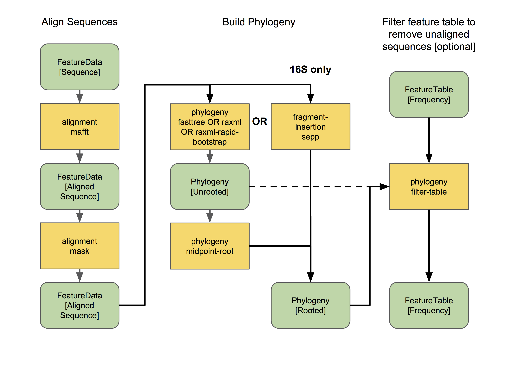

Overview of QIIME 2 Plugin Workflows
====================================

.. note:: Abandon all hope, ye who enter. If you have not read the :doc:`glossary <../glossary>`. 👺

.. note:: This is a guide for novice QIIME 2 users, and particularly for those who are new to microbiome research. For experienced users who are already well versed in microbiome analysis, and those who are adverse to uncontrolled use of emoji, mosey on over to the :doc:`overview tutorial for experienced users <qiime2-for-experienced-microbiome-researchers>`.

Welcome all newcomers 👋. This guide will give you an overview of many of the main plugins and actions available in QIIME 2, and guide you to the relevant tutorials for deeper exploration. In other words, it might not answer the question, "how do I use QIIME 2", but it will point you in the right direction. Consider this your treasure map: QIIME 2 actions are the stepping stones on your path to glory, and the flowcharts below will tell you where all the goodies are buried. 🗺️

Remember, *many paths lead from the foot of the mountain, but at the peak we all gaze at the same moon.* 🌕

Let's get oriented: flowcharts
------------------------------

Before we begin talking about specific plugins and actions, we will discuss a conceptual overview of a standard QIIME 2 workflow for analyzing amplicon sequence data. And before we look at that overview, we must look at the key to our treasure map:

.. _`key`:

.. image:: images/key.png

Each type of data (i.e., Artifacts and Visualizations) and action (i.e., methods, visualizers, and pipelines) is represented by a different color-coded node. The edges connecting each node is either solid (representing either required input or output) or dashed (representing optional input). Don't know what these terms mean? Arrgh! Read the note at the top of this page.

In the flowcharts below:

* Actions are labeled with the name of the plugin and the name of the action. To use that action, type "qiime" and then the text contained in that node. E.g., ``qiime demux emp-single``.
* Note that pipelines are a special type of action, that actually runs multiple actions in a single command. Neat! In (some of) the flowcharts, the pipelines are displayed as boxes encompassing the actions that are run inside. 🌯
* Artifacts are labeled with the :doc:`semantic type <../semantic-types>` of that file. Don't worry — you will not need to type out those long names unless if you need to :doc:`import <importing>` a file into that format.
* Visualizations are variously labeled as "visualization", some name that represents the information shown in that visualization, or replaced with an image representing some of the tasty information you might find inside that visualization... 🍙

Useful points for beginners
---------------------------

Just a few more **important points** before we go further:

1. The guide below is not exhaustive by any means. It only covers some of the chief actions in most of the "core" QIIME 2 plugins. There are many more actions and plugins to discover. Curious to learn more? See all installed plugins by typing ``qiime --help`` into your terminal (and hit "enter"). See all actions in the ``demux`` plugin by typing ``qiime demux --help``. Learn about the ``emp-single`` method in ``demux`` by typing ``qiime demux emp-single --help``. Now you know how to access the help documentation for all other plugins and actions. 😊
2. The flowcharts below are designed to be as simple as possible, and hence omit many of the inputs (particularly optional inputs and metadata) and outputs (particularly statistical summaries and other minor outputs) and all of the possible parameters from most actions. Many additional actions (e.g., for displaying statistical summaries or fiddling with feature tables 🎻) are also omitted. Now that you know all about the help documentation, use it to learn more about individual actions, and other actions present in a plugin (hint: if a plugin has additional actions not described here, they are probably used to examine the output of other actions in that plugin).
3. :doc:`Metadata <metadata>` is a central concept in QIIME 2. We do not extensively discuss metadata in this guide, because working with metadata is already thoroughly explained :doc:`here <metadata>`. Read well and go far. 📚
4. Artifacts (``.qza``) and visualizations (``.qzv``) files are really just zipped archives containing one or more data files and accessory files containing provenance information. You can just ``unzip`` an artifact/visualization at any time to peek inside, but the better way to do this is to use ``qiime tools export`` as detailed in our :doc:`exporting tutorials <exporting>`. Give it a spin and see if you can figure out what types of file formats are stored inside different types of artifacts! If you really want to read more about the structure of artifact/visualization files, `read on`_. 🤓
5. There is no one way to do things in QIIME 2. Nor is there a "QIIME 2" approach. Most of the plugins and actions in QIIME 2 are independent software or pre-existing methods. QIIME is the glue that makes the magic happen. *Many paths lead from the foot of the mountain...* ⛰️
6. Do not forget to cite appropriately! Unsure what to cite? To see the citations for a specific action or plugin, type in the help commands that you learned above, but replace ``--help`` with ``--citations``. Even better: go to https://view.qiime2.org/ and drag and drop any QIIME 2 artifact or visualization into the window. Provided that file was generated in QIIME 2018.4+, the "citations" tab should contain information on **all** relevant citations used for the generation of that file. Groovy. 😎

💃💃💃

Conceptual overview of QIIME 2
------------------------------

Now that we have read the glossary and key, let us examine a conceptual overview of the various possible workflows for examining amplicon sequence data:

.. _`overview`:

.. image:: images/overview.png

The edges and nodes in this overview do not represent specific actions or data types, but instead represent conceptual categories, e.g., the basic types of data or analytical goals we might have in an experiment. All of these steps and terms are discussed in more detail below.

All data must be :doc:`imported <importing>` as a QIIME 2 artifact to be used by a QIIME 2 action (with the exception of some :doc:`metadata <metadata>`). Different users may enter this workflow at different stages. Most will have some type of raw sequence (e.g., FASTQ or FASTA) data, which should be imported following the appropriate :ref:`sequence importing <importing seqs>` scheme. Other users may start with demultiplexed sequence data, or even a :ref:`feature table <importing feature tables>` given to them by a collaborator. The :doc:`importing <importing>` tutorial covers the most common data types that users need to import into QIIME 2.

Now that we understand that we can actually enter into this overview workflow at nearly *any* of the nodes, let us walk through individual sections.

1. All amplicon/metagenome sequencing experiments begin, at some point or another, as raw sequence data. This is probably FASTQ data, containing DNA sequences and quality scores for each base.
2. We must :ref:`demultiplex <Demultiplexing>` these reads to determine which sample each read came from.
3. Reads should then be :ref:`denoised <Denoising>` into amplicon sequence variants (ASVs) or clustered into operational taxonomic units (OTUs) to `achieve two goals`_:
	a. reducing sequence errors
	b. dereplicating sequences
4. The resulting feature table and representative sequences are key pieces of data. Don't lose them! A feature table is essentially a matrix of samples x observations, i.e., the number of times each "feature" (OTUs, ASVs, etc) is observed in each sample in a data set.
5. We can do many things with this feature table. Common analyses include:
	a. :ref:`Taxonomic classification <Taxonomy>` of sequences (a.k.a., "what species are present?")
	b. :ref:`Alpha and beta diversity analyses <Diversity>`, or measures of diversity within and between samples, respectively (a.k.a., "how similar are my samples?")
	c. Many diversity analyses rely on the phylogenetic similarity between individual features. If you are sequencing phylogenetic markers (e.g., 16S rRNA genes), you can :ref:`align these sequences to assess the phylogenetic relationship <alignment>` between each of your features.
	d. Differential abundance measurements determine which features (OTUs, ASVs, taxa, etc) are significantly more/less abundant in different experimental groups.

This is just the beginning, and :ref:`many other statistical tests and plotting methods are at your finger tips <Fun>` (QIIME 2) and in the lands beyond. The world is your oyster. Let's dive in. 🏊

.. warning:: Whoa! Hold yer horses there hoss! 🏇 We are going to start using some seriously technical language in the following sections 🤓. Did you read up on your :doc:`semantic types <../semantic-types>` and :doc:`core concepts <../concepts>`? Do so now or proceed at your own risk. ⚡⚡⚡

.. _`Demultiplexing`:

Demultiplexing
--------------
Okay! Imagine we have just received some FASTQ data, hot off the sequencing instrument. Most next-gen sequencing instruments have the capacity to analyze hundreds or even thousands of samples in a single lane/run; we do so by *multiplexing* these samples, which is just a fancy word for mixing a whole bunch of stuff together. How do we know which sample each read came from? This is typically done by appending a unique barcode (a.k.a. index or tag) sequence to one or both ends of each sequence. Detecting these barcode sequences and mapping them back to the samples they belong to allows us to *demultiplex* our sequences.

Want to get started demultiplexing? You (or whoever prepared and sequenced your samples) should know which barcode belongs to each sample — if you do not know, talk to your lab mates or sequencing center. Include this barcode information in your :doc:`sample metadata <metadata>` file.

The process of demultiplexing (as it occurs in QIIME 2) will look something like the following workflow (ignore the right-hand side of this flow chart for now):

.. _`derep-denoise`:

.. image:: images/derep-denoise.png

This flowchart describes all demultiplexing steps that are currently possible in QIIME 2, depending on the type of raw data you have imported. Usually only one of the different demultiplexing actions available in ``q2-demux`` or ``q2-cutadapt`` will be applicable for your data, and that is all you will need.

Read more about demultiplexing and give it a spin with the :ref:`moving pictures tutorial <moving pics demux>` (for single-end data) and :ref:`Atacama soils tutorial <atacama demux>` (for paired-end data). Those tutorials cover EMP format data (as described in the :ref:`importing docs <importing seqs>`). Have barcodes and primers in-line in your reads? See the `cutadapt tutorials`_ for using the demux methods in ``q2-cutadapt``. Have dual-indexed reads or mixed-orientation reads or some other unusual format? Pray hard 🙏. Then check out the QIIME 2 forum to see if someone has found a workaround. 😉

Paired-end reads need to be joined at some point in the analysis. If you followed the :ref:`Atacama soils tutorial <atacama demux>`, you will see that this happens automatically during denoising with ``q2-dada2``. However, if you want to use ``q2-deblur`` or an OTU clustering method (as described in more detail below), use ``q2-vsearch`` to join these reads before proceeding, as shown in the :ref:`demultiplexing workflow <derep-denoise>`. To learn more about read joining, see the :doc:`read joining tutorial <read-joining>`.👯

If you are beginning to pull your hair and foam at the mouth, do not despair: QIIME 2 tends to get easier the further we travel in the :ref:`"general overview" <overview>`. Importing and demultiplexing raw sequencing data happens to be the most frustrating part for most new users 😤. But once you get the hang of it, it's a piece of cake. 🍰

.. _`Denoising`:

Denoising and clustering
------------------------

Congratulations on getting this far! Denoising and clustering steps are slightly less confusing than importing and demultiplexing! 🎉😬🎉

The names for these steps are very descriptive:

1. We *denoise* our sequences to remove and/or correct noisy reads. 🔊
2. We *dereplicate* our sequences to reduce repetition and file size/memory requirements in downstream steps (don't worry! we keep count of each replicate). 🕵️
3. We *cluster* sequences to collapse similar sequences (e.g., those that are ≥ 97% similar to each other) into single replicate sequences. This process, also known as *OTU picking*, was once a common procedure, used to simultaneously dereplicate but also perform a sort of quick-and-dirty denoising procedure (to capture stochastic sequencing and PCR errors, which should be rare and similar to more abundant centroid sequences). Use denoising methods instead if you can. Times have changed. Welcome to the future. 😎

Denoising
^^^^^^^^^
Let's start with denoising, which is depicted on the right-hand side of :ref:`the demultiplexing and denoising workflow <derep-denoise>`.

The denoising methods currently available in QIIME 2 include `DADA2`_ and `Deblur`_. You can learn more about those methods by reading the original publications for each. Examples of DADA2 exist in the :doc:`moving pictures tutorial <moving-pictures>` and :doc:`Fecal Microbiome Transplant study tutorial <fmt>` (for single-end data) and :doc:`Atacama soils tutorial <atacama-soils>` (for paired-end data). Examples of Deblur exist in the :doc:`moving pictures tutorial <moving-pictures>` (for single-end data) and :doc:`read joining tutorial <read-joining>` (for paired-end data). Note that deblur (and also ``vsearch dereplicate-sequences``) should be preceded by `basic quality-score-based filtering`_, but this is unnecessary for dada2. Both Deblur and DADA2 contain internal chimera checking methods and abundance filtering, so additional filtering should not be necessary following these methods. 🦁🐐🐍

To put it simply, these methods filter out noisy sequences, correct errors in marginal sequences (in the case of DADA2), remove chimeric sequences, remove singletons, join denoised paired-end reads (in the case of DADA2), and then dereplicate those sequences. 😎

The features produced by denoising methods go by many names, usually some variant of "sequence variant" (SV), "amplicon SV" (ASV), "actual SV", "exact SV"... I believe we already referred to these as ASVs in this tutorial, so let's keep our nomenclature consistent. 📏

Clustering
^^^^^^^^^^
Next we will discuss clustering methods. Dereplication (the simplest clustering method, effectively producing 100% OTUs, i.e., all unique sequences observed in the dataset) is also depicted in :ref:`the demultiplexing and denoising workflow <derep-denoise>`, and is the necessary starting point to all other clustering methods in QIIME 2, as shown here:

.. image:: images/clustering.png

``q2-vsearch`` implements three different `OTU clustering strategies`_: de novo, closed reference, and open reference. All should be preceded by `basic quality-score-based filtering`_ and followed by :doc:`chimera filtering <chimera>` and `aggressive OTU filtering`_ (the treacherous trio, a.k.a. the Bokulich method). 🙈🙉🙊

The :doc:`OTU clustering tutorial <otu-clustering>` demonstrates use of several ``q2-vsearch`` clustering methods. Don't forget to read the :doc:`chimera filtering tutorial <chimera>`!

The features produced by clustering methods are known as operational taxonomic units (OTUs), which is `Esperanto`_ for suboptimal, imprecise rubbish. 🚮

The Feature Table
^^^^^^^^^^^^^^^^^
The final products of all denoising and clustering methods/workflows are a ``FeatureTable[Frequency]`` (feature table) artifact and a ``FeatureData[Sequence]`` (representative sequences) artifact. These are two of the most important artifacts in an amplicon sequencing workflow, and are used for many downstream analyses, as discussed below. Indeed, feature tables are crucial to any QIIME 2 analysis, as the central record of all observations per sample. Such an important artifact deserves its own powerful plugin, `q2-feature-table`_. We will not discuss all actions of this plugin in detail here (some are mentioned below), but it performs many useful operations on feature tables so familiarize yourself with its documentation! 😴

**I repeat**: feature tables are central to analysis in QIIME 2. Almost all analysis steps (i.e., following demultiplexing and denoising/clustering) involve feature tables in some way. **Pay attention!** 😳

.. note:: Want to see which sequences are associated with each feature ID? Use ``qiime metadata tabulate`` with your ``FeatureData[Sequence]`` artifact as input.

Congratulations! 🎉 You've made it past importing, demultiplexing, and denoising/clustering your data, which are the most complicated and difficult steps for most users (if only because there are so many ways to do it!). If you've made it this far, the rest should be easy peasy. Now begins the fun. 🍾

.. _`Taxonomy`:

Taxonomy classification and taxonomic analyses
----------------------------------------------

For many experiments, investigators aim to identify the organisms that are present in a sample. E.g., what genera or species are present in my samples? Are there any human pathogens in this patient's sample? `What's swimming in my wine`_? 🍷🤑

We can do this by comparing our query sequences (i.e., our features, be they ASVs or OTUs) to a reference database of sequences with known taxonomic composition. Simply finding the closest alignment is not really good enough — because other sequences that are equally close matches or nearly as close may have different taxonomic annotations. So we use *taxonomy classifiers* to determine the closest taxonomic affiliation with some degree of confidence or consensus (which may not be a species name if one cannot be predicted with certainty!), based on alignment, k-mer frequencies, etc. Those `interested in learning more about taxonomy classification`_ in QIIME 2 can read until the cows come home. 🐄🐄🐄

Let's see what a taxonomy classification workflow might look like:

.. _`taxonomy flowchart`:

``q2-feature-classifier`` contains three different classification methods. ``classify-consensus-blast`` and ``classify-consensus-vsearch`` are both alignment-based methods that find a consensus assignment across N top hits. These methods take reference database ``FeatureData[Taxonomy]`` and ``FeatureData[Sequence]`` files directly, and do not need to be pre-trained.

Machine-learning-based classification methods are available through ``classify-sklearn``, and theoretically can apply any of the classification methods available in `scikit-learn`_. These classifiers must be *trained*, e.g., to learn which features best distinguish each taxonomic group, adding an additional step to the classification process. :doc:`Classifier training <feature-classifier>` is **reference database- and marker-gene-specific** and only needs to happen once per marker-gene/reference database combination; that classifier may then be re-used as many times as you like without needing to re-train!

Most users do not even need to follow that tutorial and perform that training step, because the lovely QIIME 2 developers provide several :doc:`pre-trained classifiers <../data-resources>` for public use. 🎅🎁🎅🎁🎅🎁

**Which method is best?** `They are all pretty good`_, otherwise we wouldn't bother exposing them here. 😎 But in general ``classify-sklearn`` with a Naive Bayes classifier can slightly outperform other methods we've tested based on several criteria for classification of 16S rRNA gene and fungal ITS sequences. It can be more difficult and frustrating for some users, however, since it requires that additional training step. That training step can be memory intensive, becoming a barrier for some users who are unable to use the :doc:`pre-trained classifiers <../data-resources>`. Some users also prefer the alignment-based methods because their mode of operation is much more transparent and their parameters easier to manipulate (see the link above for description of these parameters and recommended settings for different applications).

**Feature classification can be slow**. It all depends on the number of sequences you have, and the number of reference sequences. OTU clustered sequences will take longer to classify (because often there are more). Filter low-abundance features out of your sequences file before classifying, and use smaller reference databases if possible if you have concerns about runtime. In practice, in "normal size" sequencing experiments (whatever that means 😜) we see variations between a few minutes (a few hundred features) to many hours (hundreds of thousands of features) for classification to complete. If you want to hang some numbers on there, `check out our benchmarks`_ for classifier runtime performance. 🏃⏱️

**Feature classification can be memory intensive**. We usually see minimum 4 GB RAM, maximum 32+ GB required. It all depends on the size of the reference sequences, their length, and number of query sequences...

Examples of using ``classify-sklearn`` are shown in the :doc:`feature classifier tutorial <feature-classifier>` and in the :ref:`moving pictures tutorial <moving pics taxonomy>`. The :ref:`taxonomy flowchart <taxonomy flowchart>` should make the other classifier methods reasonably clear.

All classifiers produce a ``FeatureData[Taxonomy]`` artifact containing a list of taxonomy classifications for each query sequence.

.. note:: Want to see which sequences and taxonomic assignments are associated with each feature ID? Use ``qiime metadata tabulate`` with your ``FeatureData[Taxonomy]`` and ``FeatureData[Sequence]`` artifacts as input.

.. _`taxonomy-driven analysis`:

Now that we have classified our sequences
^^^^^^^^^^^^^^^^^^^^^^^^^^^^^^^^^^^^^^^^^
Taxonomic classification opens us up to a whole new world of possibilities. 🌎

Here are the main actions that are enabled by having a ``FeatureData[Taxonomy]`` artifact:

1. **Collapse your feature table** with ``taxa collapse``! This merges all features that share the same taxonomic assignment into a single feature. That taxonomic assignment becomes the feature ID in the new feature table. This feature table :ref:`can be used in all the same ways as the original <Fun>`. Some users may be specifically interested in performing, e.g., taxonomy-informed :ref:`diversity analyses <Diversity>`, but at the very least anyone assigning taxonomy is probably interested in testing :ref:`differential abundance <Fun>` of those taxa. Comparing differential abundance analyses using taxa as features vs. using ASVs or OTUs as features can be diagnostic and informative for various analyses. 🌂
2. **Plot your taxonomic composition** to see the abundance of various taxa in each of your samples. Check out ``taxa barplot`` and ``feature-table heatmap`` for more details. 📊
3. **Filter your feature table and representative sequences** (``FeatureData[Sequence]`` artifact) to remove certain taxonomic groups. This is useful for removing known contaminants or non-target groups, e.g., host DNA including mitochondrial or chloroplast sequences. It can also be useful for focusing on specific groups for deeper analysis. See the :doc:`filtering tutorial <filtering>` for more details and examples. 🌿🐀

.. _`alignment`:

Sequence alignment and phylogeny building
-----------------------------------------
Many diversity analyses rely on the phylogenetic similarity between individual features. If you are sequencing phylogenetic markers (e.g., 16S rRNA genes), you can align these sequences to assess the phylogenetic relationship between each of your features. This phylogeny can then be used by other downstream analyses, such as `UniFrac distance`_ analyses.

The different options for aligning sequences and producing a phylogeny are shown in the flowchart below. For detailed description of alignment/phylogeny building, see the `q2-phylogeny tutorial`_ and the `q2-fragment-insertion tutorial`_. 🌳

Now that we have our ``Phylogeny[Rooted]`` artifact, pay attention to where it is used below. 👀

.. _`Diversity`:

Diversity analysis
------------------

In microbiome experiments, investigators frequently wonder about things like:

* How many different species/OTUs/ASVs are present in my samples?
* How much phylogenetic diversity is present in each sample?
* How similar/different are individual samples and groups of samples?
* What factors (e.g., pH, elevation, blood pressure, body site, or host species just to name a few examples) are associated with differences in microbial composition and biodiversity?

And more. These questions can be answered by alpha- and beta-diversity analyses. Alpha diversity measures the level of diversity within individual samples. Beta diversity measures the level of diversity or dissimilarity between samples. We can then use this information to statistically test whether alpha diversity is different between groups of samples (indicating, e.g., that those groups have more/less species richness) and whether beta diversity is greater between groups (indicating, e.g., that samples within a group are more similar to each other than those in another group, suggesting that membership within these groups is shaping the microbial composition of those samples).

Different types of diversity analyses in QIIME 2 are exemplified in the the :ref:`moving pictures tutorial <moving pics diversity>` and :ref:`fecal microbiome transplant tutorial <fmt diversity>`, and the full suite of analyses used to generate diversity artifacts are shown here (and that's not all: note that other plugins can operate on these artifacts, as described further in this guide):

The ``q2-diversity`` plugin contains `many different useful actions`_! Check them out to learn more. As you can see in the flowchart, the ``diversity core-metrics*`` pipelines (``core-metrics`` and ``core-metrics-phylogenetic``) encompass many different core diversity commands, and in the process produce the main diversity-related artifacts that can be used in downstream analyses. These are:

* ``SampleData[AlphaDiversity]`` artifacts, which contain alpha diversity estimates for each sample in your feature table. This is the chief artifact for alpha diversity analyses.
* ``DistanceMatrix`` artifacts, containing the pairwise distance/dissimilarity between each pair of samples in your feature table. This is the chief artifact for beta diversity analyses.
* ``PCoAResults`` artifacts, containing principal coordinates ordination results for each distance/dissimilarity metric. `Principal coordinates analysis`_ is a dimension reduction technique, facilitating visual comparisons of sample (dis)simmilarities in 2D or 3D space.

These are the main diversity-related artifacts. Keep them safe! We can re-use these data in :ref:`all sorts of downstream analyses <Fun>`, or in the various actions of ``q2-diversity`` shown in the flowchart. Most of these actions are demonstrated in the :ref:`moving pictures tutorial <moving pics diversity>` so head on over there to learn more! ☔

Note that there are many, many different alpha- and beta-`diversity metrics`_ that are available in QIIME 2. To learn more (and figure out whose paper you should be citing!), check out that neat resource, which was contributed by a friendly QIIME 2 user to enlighten all of us. Thanks Stephanie! 😁🙏😁🙏😁🙏

.. _`Fun`:

Fun with feature tables
-----------------------

At this point you have a feature table, taxonomy classification results, alpha diversity, and beta diversity results. Oh my! 🤓

Taxonomic and diversity analyses, as described above, are the basic types of analyses that most QIIME 2 users are probably going to need to perform at some point. However, this is only the beginning, and there are so many more advanced analyses at our fingertips. 🖐️⌨️

.. image:: images/fun-with-features.png

We are only going to give a brief overview, since each of these analyses has its own in-depth tutorial to guide us:

* **Analyze longitudinal data:** :doc:`q2-longitudinal <longitudinal>` is a plugin for performing statistical analyses of `longitudinal experiments`_, i.e., where samples are collected from individual patients/subjects/sites repeatedly over time. This includes longitudinal studies of alpha and beta diversity, and some really awesome, interactive plots. 📈🍝
* **Predict the future (or the past) 🔮:** :doc:`q2-sample-classifier <sample-classifier>` is a plugin for machine-learning 🤖 analyses of feature data. Both classification and regression models are supported. This allows you to do things like:
	* predict sample metadata as a function of feature data (e.g., can we use a fecal sample to `predict cancer susceptibility`_? Or `predict wine quality`_ based on the microbial composition of grapes before fermentation?). 🍇
	* identify features that are predictive of different sample characteristics. 🚀
	* quantify rates of microbial maturation (e.g., to track normal microbiome development in the infant gut and the impacts of `persistent malnutrition`_ or `antibiotics, diet, and delivery mode`_). 👶
	* predict outliers and `mislabeled samples`_. 👹
* **Differential abundance** is used to determine which features are significantly more/less abundant in different groups of samples. QIIME 2 currently supports a few different approaches to differential abundance testing, including :ref:`ANCOM <ancom>` (an action in ``q2-composition``) and :doc:`q2-gneiss <gneiss>`. 👾👾👾
* **Evaluate and control data quality:** :doc:`q2-quality-control <quality-control>` is a plugin for evaluating and controlling sequence data quality. This includes actions that:
	* test the accuracy of different bioinformatic or molecular methods, or of run-to-run quality variation. These actions are typically used if users have samples with known compositions, e.g., `mock communities`_, since accuracy is calculated as the similarity between the observed and expected compositions, sequences, etc. But more creative uses may be possible... 🐢
	* filter sequences based on alignment to a reference database, or that contain specific short sections of DNA (e.g., primer sequences). This is useful for removing sequences that match a specific group of organisms, non-target DNA, or other nonsense. 🙃

And that's just a brief overview! QIIME 2 continues to grow, so stay tuned for more plugins in future releases 📻, and keep your eyes peeled for third-party plugins that will continue to expand the functionality availability in QIIME 2. 👀

Now go forth an have fun! 💃

.. _achieve two goals: https://doi.org/10.1038/s41579-018-0029-9
.. _read on: https://dev.qiime2.org/latest/storing-data/
.. _cutadapt tutorials: https://forum.qiime2.org/t/demultiplexing-and-trimming-adapters-from-reads-with-q2-cutadapt/2313
.. _DADA2: https://www.ncbi.nlm.nih.gov/pubmed/27214047
.. _Deblur: http://msystems.asm.org/content/2/2/e00191-16
.. _basic quality-score-based filtering: https://www.nature.com/articles/nmeth.2276
.. _OTU clustering strategies: http://qiime.org/tutorials/otu_picking.html
.. _aggressive OTU filtering: https://www.nature.com/articles/nmeth.2276
.. _What's swimming in my wine: https://doi.org/10.1073/pnas.1317377110
.. _interested in learning more about taxonomy classification: https://doi.org/10.1186/s40168-018-0470-z
.. _scikit-learn: http://scikit-learn.org
.. _They are all pretty good: https://doi.org/10.1186/s40168-018-0470-z
.. _check out our benchmarks: https://doi.org/10.1186/s40168-018-0470-z
.. _UniFrac distance: https://www.ncbi.nlm.nih.gov/pmc/articles/PMC1317376/
.. _q2-phylogeny tutorial: https://forum.qiime2.org/t/q2-phylogeny-community-tutorial/4455
.. _q2-fragment-insertion tutorial: https://library.qiime2.org/plugins/q2-fragment-insertion/16/
.. _diversity metrics: https://forum.qiime2.org/t/alpha-and-beta-diversity-explanations-and-commands/2282
.. _q2-feature-table: https://docs.qiime2.org/2020.2/plugins/available/feature-table/
.. _many different useful actions: https://docs.qiime2.org/2020.2/plugins/available/diversity/
.. _Principal coordinates analysis: https://mb3is.megx.net/gustame/dissimilarity-based-methods/principal-coordinates-analysis
.. _longitudinal experiments: https://en.wikipedia.org/wiki/Longitudinal_study
.. _predict cancer susceptibility: https://dx.doi.org/10.1128%2FmSphere.00001-15
.. _predict wine quality: http://mbio.asm.org/content/7/3/e00631-16.short
.. _persistent malnutrition: https://dx.doi.org/10.1038%2Fnature13421
.. _antibiotics, diet, and delivery mode: https://dx.doi.org/10.1126%2Fscitranslmed.aad7121
.. _mislabeled samples: https://dx.doi.org/10.1038%2Fismej.2010.148
.. _mock communities: http://mockrobiota.caporasolab.us/
.. _Esperanto: https://en.wikipedia.org/wiki/Esperanto
