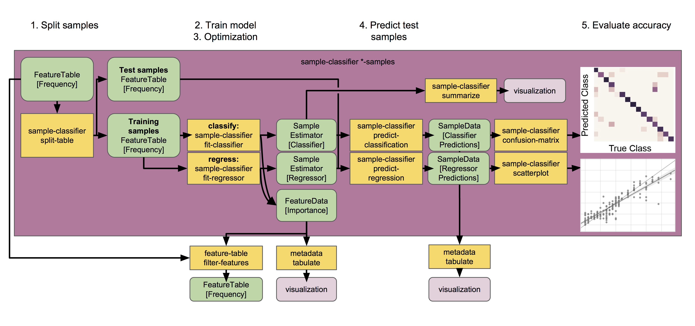

Predicting sample metadata values with q2-sample-classifier
===========================================================

.. note:: This guide assumes you have installed QIIME 2 using one of the procedures in the :doc:`install documents <../install/index>` and completed the :doc:`moving pictures tutorial <moving-pictures>`.

.. warning:: Just as with any statistical method, the actions described in this plugin require adequate sample sizes to achieve meaningful results. As a rule of thumb, a minimum of `approximately 50 samples`_ should be provided. Categorical metadata columns that are used as classifier targets should have a minimum of 10 samples per unique value, and continuous metadata columns that are used as regressor targets should not contain many outliers or grossly uneven distributions. Smaller counts will result in inaccurate models, and may result in errors.

This tutorial will demonstrate how to use ``q2-sample-classifier`` to predict sample metadata values. Supervised learning methods predict sample data (e.g., metadata values) as a function of other sample data (e.g., microbiota composition). The predicted targets may be discrete sample classes (for classification problems) or continuous values (for regression problems). Any other data may be used as predictive features, but for the purposes of q2-sample-classifier this will most commonly be microbial sequence variant, operational taxonomic unit (OTU), or taxonomic composition data. However, any features contained in a feature table may be used — for non-microbial data, just `convert your observation tables to biom format`_ and :doc:`import the feature table data into qiime2 <importing>`.

We will download and create several files, so first create a working directory.

.. command-block::
   :no-exec:

   mkdir sample-classifier-tutorial
   cd sample-classifier-tutorial

Predicting categorical sample data
----------------------------------

Supervised learning classifiers predict the categorical metadata classes of unlabeled samples by learning the composition of labeled training samples. For example, we may use a classifier to diagnose or predict disease susceptibility based on stool microbiome composition, or predict sample type as a function of the sequence variants, microbial taxa, or metabolites detected in a sample. In this tutorial, we will use the :doc:`moving pictures tutorial data <moving-pictures>` to train a classifier that predicts the body site from which a sample was collected. Download the feature table and sample metadata with the following links:

.. download::
   :url: https://data.qiime2.org/2018.8/tutorials/moving-pictures/sample_metadata.tsv
   :saveas: moving-pictures-sample-metadata.tsv

.. download::
   :url: https://data.qiime2.org/2018.8/tutorials/sample-classifier/moving-pictures-table.qza
   :saveas: moving-pictures-table.qza

Next, we will train and test a classifier that predicts which body site a sample originated from based on its microbial composition. We will do so using the ``classify-samples`` pipeline, which performs a series of steps under the hood:

1. The input samples are randomly split into a ``training`` set and a ``test`` set. The test set is held out until the end of the pipeline, allowing us to test accuracy on a set of samples that was not used for model training. The fraction of input samples to include in the test set is adjusted with the ``--p-test-size`` parameter.

2. We train the learning model using the training set samples. The model is trained to predict a specific ``target`` value for each sample (contained in a metadata column) based on the feature data associated with that sample. A range of different estimators can be selected using the ``estimator`` parameter; more details on individual estimators can be found in the `scikit-learn documentation`_ (not sure which to choose? See the `estimator selection flowchart`_).

3. K-fold `cross-validation`_ is performed during automatic feature selection and parameter optimization steps to tune the model. Five-fold cross-validation is performed by default, and this value can be adjusted using the ``--p-cv`` parameter.

4. The trained model is used to predict the target values for each test sample, based on the feature data associated with that sample.

5. Model accuracy is calculated by comparing each test sample's predicted value to the true value for that sample.

:ref:`Figure key<key>`

.. command-block::

   qiime sample-classifier classify-samples \
     --i-table moving-pictures-table.qza \
     --m-metadata-file moving-pictures-sample-metadata.tsv \
     --m-metadata-column BodySite \
     --p-optimize-feature-selection \
     --p-parameter-tuning \
     --p-estimator RandomForestClassifier \
     --p-n-estimators 20 \
     --output-dir moving-pictures-classifier

This pipeline produces several outputs. First let's check out ``accuracy_results.qzv``, which presents classification accuracy results in the form of a confusion matrix. This matrix indicates how frequently a sample is classified with the correct class vs. all other classes. The confusion matrix is displayed at the top of the visualization in the form of a heatmap, and below that as a table containing overall accuracy (the fraction of times that test samples are assigned the correct class).

.. question::
   What other metadata can we predict with ``classify-samples``? Take a look at the metadata columns in the ``sample-metadata`` and try some other categorical columns. Not all metadata can be easily learned by the classifier!

This pipeline also reports the actual predictions made for each test sample in the ``predictions.qza`` output. This is a ``SampleData[ClassifierPredictions]`` artifact, which is viewable as metadata. So we can take a peak with ``metadata tabulate``:

.. command-block::

   qiime metadata tabulate \
     --m-input-file moving-pictures-classifier/predictions.qza \
     --o-visualization moving-pictures-classifier/predictions.qzv

Another really useful output of supervised learning methods is *feature selection*, i.e., they report which features (e.g., ASVs or taxa) are most predictive. A list of all features, and their relative importances (or feature weights or model coefficients, depending on the learning model used), will be reported in ``feature_importance.qza``. Features with higher importance scores were more useful for distinguishing classes. Feature importance scores are assigned directly by the scikit-learn learning estimator that was used; more details on individual estimators and their importance scores should refer to the `scikit-learn documentation`_. Note that some estimators — notably K-nearest neighbors models — do not report feature importance scores, so this output will be meaningless if you are using such an estimator. Feature importances are of the semantic type ``FeatureData[Importance]``, and can be interpreted as (feature) metadata so we can take a look at these feature importances (and/or :ref:`merge with other feature metadata <exploring feature metadata>`) using ``metadata tabulate``:

.. command-block::

   qiime metadata tabulate \
     --m-input-file moving-pictures-classifier/feature_importance.qza \
     --o-visualization moving-pictures-classifier/feature_importance.qzv

If ``--p-optimize-feature-selection`` is enabled, only the selected features (i.e., the most important features, which maximize model accuracy, as determined using `recursive feature elimination`_) will be reported in this artifact, and all other results (e.g., model accuracy and predictions) that are output use the final, optimized model that utilizes this reduced feature set. This allows us to not only see which features are most important (and hence used by the model), but also use that information to filter out uninformative features from our feature table for other downstream analyses outside of q2-sample-classifier:

.. command-block::

   qiime feature-table filter-features \
     --i-table moving-pictures-table.qza \
     --m-metadata-file moving-pictures-classifier/feature_importance.qza \
     --o-filtered-table moving-pictures-classifier/important-feature-table.qza

This pipeline also produces a visualization containing a summary of the model parameters used by the supervised learning estimator in ``model_summary.qzv``. If ``--p-optimize-feature-selection`` is enabled, the visualization will also display a `recursive feature elimination`_ plot, which illustrates how model accuracy changes as a function of feature count. The combination of features that maximize accuracy are automatically selected for the final model, which is used for sample prediction results that are displayed in the other outputs.

.. question::
   What happens when feature optimization is disabled with the option ``--p-no-optimize-feature-selection``? How does this impact classification accuracy?

Finally, the trained classification model is saved for convenient re-use in the ``sample_estimator.qza`` artifact! This allows us to predict metadata values for additional samples. For example, imagine we just received a shipment of new samples and wanted to use our pre-trained Body Site classifier to figure out what type of samples these new samples are. For the sake of convenience in this example, we will just pretend we have new samples and predict the values of the same samples that we used to train the model but **NEVER do this in practice** because:

.. warning:: Testing a supervised learning model on the same samples used to train the model will give unrealistic estimates of performance! 🦄

.. command-block::

   qiime sample-classifier predict-classification \
     --i-table moving-pictures-table.qza \
     --i-sample-estimator moving-pictures-classifier/sample_estimator.qza \
     --o-predictions moving-pictures-classifier/new_predictions.qza

We can view these ``new_predictions.qza`` using ``metadata tabulate``, as described above... or if these aren't actually "unknown" samples we can re-test model accuracy using this new batch of samples:

.. command-block::

   qiime sample-classifier confusion-matrix \
     --i-predictions moving-pictures-classifier/new_predictions.qza \
     --m-truth-file moving-pictures-sample-metadata.tsv \
     --m-truth-column BodySite \
     --o-visualization moving-pictures-classifier/new_confusion_matrix.qzv

Pretty cool! Accuracy should be inordinately high in these results because we ignored the warning above about testing on our training data, giving you a pretty good idea why you should follow the directions on the box! 😑

.. note:: The model we trained here is a toy example containing very few samples from a single study and will probably not be useful for predicting other unknown samples. But if you have samples from one of these body sites, it could be a fun exercise to give it a spin!

.. question::
   Try to figure out what the ``--p-parameter-tuning`` parameter does. What happens when it is disabled with the option ``--p-no-parameter-tuning``? How does this impact classification accuracy?

.. question::
   Many different classifiers can be trained via the ``--p-estimator`` parameter in ``classify-samples``. Try some of the other classifiers. How do these methods compare?

.. question::
   Sequence variants are not the only feature data that can be used to train a classifier or regressor. Taxonomic composition is another feature type that can be easily created using the tutorial data provided in QIIME2. Try to figure out how this works (hint: you will need to assign taxonomy, as described in the :doc:`moving pictures tutorial <moving-pictures>`, and :doc:`collapse taxonomy <../plugins/available/taxa/collapse/>` to create a new feature table). Try using feature tables collapsed to different taxonomic levels. How does taxonomic specificity (e.g., species-level is more specific than phylum-level) impact classifier performance?

.. question::
   The ``--p-n-estimators`` parameter adjusts the number of trees grown by ensemble estimators, such as random forest classifiers (this parameter will have no effect on non-ensemble methods), which increases classifier accuracy up to a certain point, but at the cost of increased computation time. Try the same command above with different numbers of estimators, e.g., 10, 50, 100, 250, and 500 estimators. How does this impact the overall accuracy of predictions? Are more trees worth the time?

Predicting continuous (i.e., numerical) sample data
---------------------------------------------------

Supervised learning regressors predict continuous metadata values of unlabeled samples by learning the composition of labeled training samples. For example, we may use a regressor to predict the abundance of a metabolite that will be producted by a microbial community, or a sample's pH,  temperature, or altitude as a function of the sequence variants, microbial taxa, or metabolites detected in a sample. In this tutorial, we will use the `ECAM study`_, a longitudinal cohort study of microbiome development in U.S. infants. Download the feature table and sample metadata with the following links:

.. download::
   :url: https://data.qiime2.org/2018.8/tutorials/longitudinal/sample_metadata.tsv
   :saveas: ecam-metadata.tsv

.. download::
   :url: https://data.qiime2.org/2018.8/tutorials/longitudinal/ecam_table_maturity.qza
   :saveas: ecam-table.qza

Next, we will train a regressor to predict an infant's age based on its microbiota composition, using the ``regress-samples`` pipeline.

.. command-block::

   qiime sample-classifier regress-samples \
     --i-table ecam-table.qza \
     --m-metadata-file ecam-metadata.tsv \
     --m-metadata-column month \
     --p-estimator RandomForestRegressor \
     --p-n-estimators 20 \
     --output-dir ecam-regressor

The outputs produced by this command are the same as those produced by ``classify-samples``, with one exception. Regression accuracy results in ``accuracy_results.qzv`` are represented in the form of a scatter plot showing predicted vs. true values for each test sample, accompanied by a linear regression line fitted to the data with 95% confidence intervals (grey shading). The true 1:1 ratio between predicted and true values is represented by a dotted line for comparison. Below this, model accuracy is quantified in a table displaying mean square error and the R value, P value, standard error of the estimated gradient, slope, and intercept of the linear regression fit.

.. question::
   What other metadata can we predict with ``regress-samples``? Take a look at the metadata columns in the ``sample-metadata`` and try some other values. Not all metadata can be easily learned by the regressor!

.. question::
   Many different regressors can be trained via the ``--p-estimator`` parameter in ``regress-samples``. Try some of the other regressors. How do these methods compare?

Nested cross-validation provides predictions for all samples
------------------------------------------------------------
In the examples above, we split the data sets into training and test sets for model training and testing. It is *essential* that we keep a test set that the model has never seen before for validating model performance. But what if we want to predict target values for each sample in a data set? For that, my friend, we use nested cross validation (NCV). This can be valuable in a number of different cases, e.g., for predicting `mislabeled samples`_ (those that are classified incorrectly during NCV) or for assessing estimator variance (since multiple models are trained during NCV, we can look at the variance in their accuracy).

.. image:: images/nested-cv.png

:ref:`Figure key<key>`

Under the hood, NCV works a lot like the k-fold cross validation used in ``classify-samples`` and ``regress-samples`` for model optimization, but a second layer of cross validation (an "outer loop") is incorporated to split the dataset into training and test sets K times such that each sample ends up in a test set exactly once. During each iteration of the "outer loop", the training set is split again K times (in an "inner loop") to optimize parameter settings for estimation of that fold. The end result: K different final models are trained, each sample receives a predicted value, and feature importance scores are averaged across each iteration. Overall accuracy can be calculated by comparing these predicted values to their true values, as shown below, but for those interested in accuracy variance across each fold, mean accuracy ± SD is printed to the standard output.

There are NCV methods in ``q2-sample-classifier`` for both classification and regression problems. Let's give both a spin, followed by visualizers to calculate and view aggregated model accuracy results.

.. command-block::

   qiime sample-classifier classify-samples-ncv \
     --i-table moving-pictures-table.qza \
     --m-metadata-file moving-pictures-sample-metadata.tsv \
     --m-metadata-column BodySite \
     --p-estimator RandomForestClassifier \
     --p-n-estimators 20 \
     --o-predictions BodySite-predictions-ncv.qza \
     --o-feature-importance BodySite-importance-ncv.qza

.. command-block::

   qiime sample-classifier confusion-matrix \
     --i-predictions BodySite-predictions-ncv.qza \
     --m-truth-file moving-pictures-sample-metadata.tsv \
     --m-truth-column BodySite \
     --o-visualization ncv_confusion_matrix.qzv

.. command-block::

   qiime sample-classifier regress-samples-ncv \
     --i-table ecam-table.qza \
     --m-metadata-file ecam-metadata.tsv \
     --m-metadata-column month \
     --p-estimator RandomForestRegressor \
     --p-n-estimators 20 \
     --o-predictions ecam-predictions-ncv.qza \
     --o-feature-importance ecam-importance-ncv.qza

.. command-block::

   qiime sample-classifier scatterplot \
     --i-predictions ecam-predictions-ncv.qza \
     --m-truth-file ecam-metadata.tsv \
     --m-truth-column month \
     --o-visualization ecam-scatter.qzv

.. note:: We use ``confusion-matrix`` to calculate classifier accuracy, and ``scatterplot`` for regressor accuracy. 👀

So the NCV methods output feature importance scores and sample predictions, but not trained estimators (as is done for the ``classify-samples`` and ``regress-samples`` pipelines above). This is because (1) *k* models are actually used for prediction, where *k* = the number of CV folds used in the outer loop, so returning and re-using the estimators would get very messy; and (2) users interested in NCV are *most likely* not interested in re-using the models for predicting new samples.

"Maturity Index" prediction
---------------------------

.. note:: This analysis currently works best for comparing groups that are sampled fairly evenly across time (the column used for regression). Datasets that contain groups sampled sporadically at different times are not supported, and users should either filter out those samples or “bin” them with other groups prior to using this visualizer.
.. note:: This analysis will only work on data sets with a large sample size, particularly in the "control" group, and with sufficient biological replication at each time point.

This method calculates a "microbial maturity" index from a regression model trained on feature data to predict a given continuous metadata column ("state_column"), e.g., to predict a subject's age as a function of microbiota composition. This method is different from standard supervised regression because it quantifies the relative rate of change over time in two or more groups. The model is trained on a subset of control group samples, then predicts the column value for all samples. This visualization computes maturity index z-scores (MAZ) to compare relative "maturity" between each group, as described in `Sathish et al. 2014`_. This method was designed to predict between-group differences in intestinal microbiome development by age, so ``state_column`` should typically be a measure of time. Other types of continuous metadata gradients might be testable, as long as two or more different "treatment" groups are being compared *with a large number of biological replicates* in the "control" group and treatment groups are sampled at the same "states" (time or position on gradient) for comparison. However, we do not necessarily recommend *or offer technical support* for unusual approaches.

Here we will compare microbial maturity between vaginally born and cesarean-delivered infants as a function of age in the ECAM dataset.

.. command-block::

   qiime sample-classifier maturity-index \
     --i-table ecam-table.qza \
     --m-metadata-file ecam-metadata.tsv \
     --p-state-column month \
     --p-group-by delivery \
     --p-individual-id-column studyid \
     --p-control Vaginal \
     --p-test-size 0.4 \
     --output-dir maturity

This pipeline produces several output files:

1. ``accuracy_results.qzv`` contains a linear regression plot of predicted vs. expected values on all control test samples (as described above for regression models). This is a subset of "control" samples that were not used for model training (the fraction defined by the ``test-size`` parameter).

2. ``lineplots.qzv`` contains an interactive volitility chart as described in the :doc:`longitudinal tutorial <longitudinal>`. This visualization can be useful for assessing how MAZ and other metrics change over time in each sample group (by default, the ``group_by`` column is used but other sample metadata may be selected for grouping samples). The default metric displayed on this chart is MAZ scores for the chosen ``state_column``. The "prediction" (predicted "state_column" values) and state_column "maturity" metrics are other metrics calculated by this plugin that can be interesting to explore. See `Sathish et al. 2014`_ for more details on the MAZ and maturity metrics.

3. ``clustermap.qzv`` contains a heatmap showing the frequency of each important feature across time in each group. This plot is useful for visualizing how the frequency of important features changes over time in each group, demonstrating how different patterns of feature abundance (e.g., trajectories of development in the case of age or time-based models) may affect model predictions and MAZ scores. Important features shown along the x-axis; samples grouped and ordered by ``group_by`` and ``state_column`` are shown on the y-axis. See :doc:`heatmap <../plugins/available/feature-table/heatmap/>` for details on how features are clustered along the x-axis (default parameters are used).

4. ``maz_scores.qza`` contains MAZ scores for each sample (excluding training samples). This is useful for downstream testing as described below.

5. ``predictions.qza`` contains "state column" predictions for each sample (excluding training samples). These predictions are used to calculate the MAZ scores, and a subset (control test samples) are used to assess model accuracy. Nonetheless, the predictions are supplied in case they prove useful...

6. ``feature_importance.qza`` contains importance scores for all features included in the final regression model. If the ``optimize-feature-selection`` parameter is used, this will only contain important features; if not, importance scores will be assigned to all features in the original feature table.

7. ``sample_estimator.qza`` contains the trained ``SampleEstimator[Regressor]``. You probably will not want to re-use this estimator for predicting other samples (since it is trained on a subset of samples), but nevertheless it is supplied for the curious and intrepid.

8. ``model_summary.qzv`` contains a summary of the model parameters used by the supervised learning estimator, as described above for the equivalently named outputs from the ``classify-samples`` pipeline.

So what does this all show us? In the ECAM dataset that we are testing here, we see that MAZ scores are suppressed in Cesarean-delivered subjects in the second year of life, compared to vaginally born subjects (See ``lineplots.qzv``). Several important sequence variants exhibit reduced frequency during this time frame, suggesting involvement in delayed maturation of the Cesarean cohort (See ``clustermap.qzv``). (This tutorial example does not have a ``random-state`` set so local results may vary slightly)

Note that none of the results presented so far actually confirm a statistical difference between groups. Want to take this analysis to the next level (with multivariate statistical testing)? Use the MAZ scores (or possibly ``predictions``) as input metrics (dependent variables) in :doc:`linear mixed effects models <longitudinal>`.

Best practices: things you should not do with q2-sample-classifier
------------------------------------------------------------------

As this tutorial has demonstrated, q2-sample-classifier can be extremely powerful for feature selection and metadata prediction. However, with power comes responsibility. Unsuspecting users are at risk of committing grave errors, particularly from overfitting and data leakage. Here follows an (inevitably incomplete) list of ways that users can abuse *this plugin*, yielding misleading results. Do not do these things. More extensive guides exist for avoiding data leakage and overfitting *in general*, so this list focuses on bad practices that are particular to this plugin and to biological data analysis.

1. **Data leakage** occurs whenever a learning model learns (often inadvertently) about test sample data, leading to unduly high performance estimates.

   a. Model accuracy should always be assessed on test data that has never been seen by the learning model. The pipelines and nested cross-validation methods in q2-sample-classifier (including those described in this tutorial) do this by default. However, care must be taken when using the ``fit-*`` and ``predict-*`` methods independently.

   b. In some situations, technical replicates could be problematic and lead to pseudo-data leakage, depending on experimental design and technical precision. If in doubt, :doc:`group <../plugins/available/feature-table/group/>` your feature table to average technical replicates, or filter technical replicates from your data prior to supervised learning analysis.

2. **Overfitting** occurs whenever a learning model is trained to overperform on the training data but, in doing so, cannot generalize well to other data sets. This can be problematic, particularly on small data sets and whenever input data have been contorted in inappropriate ways.

   a. If the learning model is intended to predict values from data that is produced in batches (e.g., to make a diagnosis on microbiome sequence data that will be produced in a future analysis), consider incorporating multiple batches in your training data to reduce the likelihood that learning models will overfit on batch effects and similar noise.

   b. Similarly, be aware that batch effects can strongly impact performance, particularly if these are covariates with the target values that you are attempting to predict. For example, if you wish to classify whether samples belong to one of two different groups and those groups were analyzed on separate sequencing runs (for microbiome amplicon sequence data), training a classifier on these data will likely lead to inaccurate results that will not generalize to other data sets.

.. _approximately 50 samples: http://scikit-learn.org/stable/tutorial/machine_learning_map/index.html
.. _convert your observation tables to biom format: http://biom-format.org/documentation/biom_conversion.html
.. _ECAM study: https://doi.org/10.1126/scitranslmed.aad7121
.. _scikit-learn documentation: http://scikit-learn.org/stable/supervised_learning.html
.. _estimator selection flowchart: http://scikit-learn.org/stable/tutorial/machine_learning_map/index.html
.. _recursive feature elimination: http://scikit-learn.org/stable/modules/feature_selection.html#recursive-feature-elimination
.. _Sathish et al. 2014: https://doi.org/10.1038/nature13421
.. _cross-validation: https://en.wikipedia.org/wiki/Cross-validation_(statistics)
.. _mislabeled samples: https://doi.org/10.1038/ismej.2010.148
